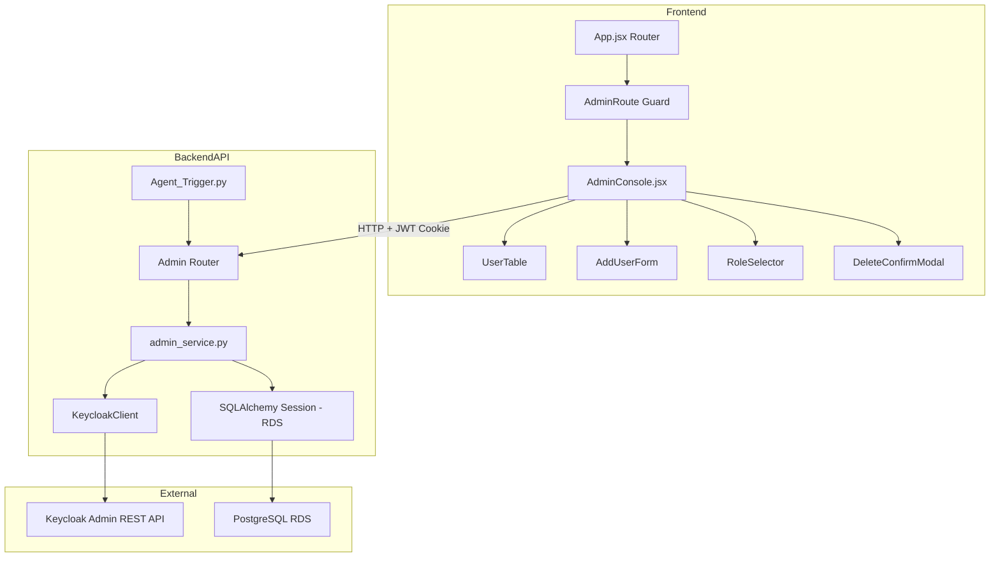
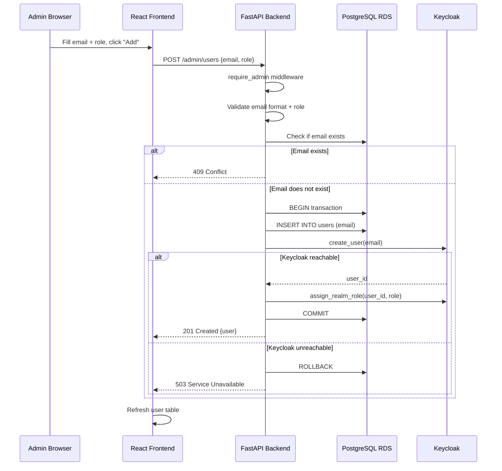

# Design Document: Admin User Management

## Overview

This design describes the Admin Console for User Management — a full CRUD interface that allows administrators to manage users and their role assignments across both RDS (login allow-list) and Keycloak (role authority).

The system extends the existing FastAPI backend with new admin endpoints and introduces a dedicated React admin page at `/admin`. The design preserves the current authentication flow (Google OAuth2 → JWT cookie) and role model (Keycloak as sole role authority, RDS as login allow-list).

**Key Design Decisions:**
- **Backend service layer pattern**: New admin logic lives in a dedicated `admin_service.py` module to keep `Agent_Trigger.py` thin and testable.
- **Pydantic request/response models**: Strict input validation via Pydantic schemas with clear error messages.
- **Transactional consistency**: RDS writes are wrapped in transactions; on Keycloak failure during add-user, the RDS insert is rolled back. On Keycloak failure during delete, the RDS deletion proceeds with a warning.
- **Frontend admin page**: A new `AdminConsole.jsx` component at `/admin` guarded by an `AdminRoute` wrapper that checks the user's role.

## Architecture



### Request Flow (Add User Example)



## Components and Interfaces

### Backend Components

#### 1. Admin Router (new endpoints in `Agent_Trigger.py`)

| Endpoint | Method | Description | Auth |
|----------|--------|-------------|------|
| `GET /admin/users` | GET | List users with Keycloak roles | `require_admin` |
| `POST /admin/users` | POST | Add user + assign role | `require_admin` |
| `PUT /admin/users/{email}/role` | PUT | Change user role | `require_admin` |
| `DELETE /admin/users/{email}` | DELETE | Delete user from RDS + Keycloak | `require_admin` |
| `GET /admin/roles` | GET | List assignable roles | `require_admin` |

#### 2. Admin Service (`BackendAPI/admin_service.py`)

Pure business logic layer that orchestrates RDS and Keycloak operations:

```python
class AdminService:
    def list_users_with_roles(db, keycloak_client) -> ListUsersResponse
    def add_user(db, keycloak_client, email, role) -> UserResponse
    def change_user_role(db, keycloak_client, email, new_role) -> UserResponse
    def delete_user(db, keycloak_client, email) -> DeleteResponse
    def get_assignable_roles() -> list[RoleInfo]
```

#### 3. Pydantic Schemas (`BackendAPI/admin_schemas.py`)

Request and response models for type safety and validation.

#### 4. Extended KeycloakClient Methods

New methods added to `BackendAPI/auth/keycloak_client.py`:

```python
def delete_user(self, email: str) -> None
def remove_realm_roles(self, user_id: str, role_names: list[str]) -> None
```

### Frontend Components

#### 1. AdminConsole (`Frontend/src/components/AdminConsole.jsx`)
- Container component for the admin page
- Fetches user list on mount, manages state
- Provides add/edit/delete handlers

#### 2. AdminRoute (`Frontend/src/components/AdminRoute.jsx`)
- Route guard that checks `role === 'admin'`
- Redirects non-admins to `/`

#### 3. Admin API Service (`Frontend/src/services/adminApi.js`)
- `getUsers()` → GET /admin/users
- `addUser(email, role)` → POST /admin/users
- `changeRole(email, role)` → PUT /admin/users/{email}/role
- `deleteUser(email)` → DELETE /admin/users/{email}
- `getRoles()` → GET /admin/roles

### Modified Existing Components

| File | Change |
|------|--------|
| `Frontend/src/App.jsx` | Add `/admin` route with `AdminRoute` guard |
| `Frontend/src/components/UserProfile.jsx` | Add "Admin Console" button (visible only if role=admin) |
| `BackendAPI/Agent_Trigger.py` | Import admin router, replace existing `GET /admin/users` |
| `BackendAPI/auth/keycloak_client.py` | Add `delete_user`, `remove_realm_roles` methods |

## Data Models

### Existing RDS `users` Table (unchanged)

```sql
CREATE TABLE users (
    id SERIAL PRIMARY KEY,
    email VARCHAR(255) UNIQUE NOT NULL,
    created_at TIMESTAMP WITH TIME ZONE DEFAULT CURRENT_TIMESTAMP,
    last_login TIMESTAMP WITH TIME ZONE DEFAULT CURRENT_TIMESTAMP
);
```

No schema changes needed. The `users` table remains role-free — roles live exclusively in Keycloak.

### Pydantic Request Models

```python
class AddUserRequest(BaseModel):
    email: EmailStr          # Validated email format
    role: str                # Must be an Assignable_Role

class ChangeRoleRequest(BaseModel):
    role: str                # Must be an Assignable_Role
```

### Pydantic Response Models

```python
class UserWithRole(BaseModel):
    id: int
    email: str
    created_at: int | None          # Unix ms timestamp
    last_login: int | None          # Unix ms timestamp
    role: str                        # From Keycloak, or "unknown"

class ListUsersResponse(BaseModel):
    users: list[UserWithRole]
    warning: str | None = None       # Set if Keycloak unreachable

class RoleInfo(BaseModel):
    value: str                       # e.g. "viewer_with_query"
    display_name: str                # e.g. "Viewer (with Query Access)"

class DeleteUserResponse(BaseModel):
    message: str
    email: str
    warning: str | None = None       # Set if Keycloak deletion failed

class ErrorResponse(BaseModel):
    detail: str
```

### API Contracts

#### POST /admin/users — Add User

**Request:**
```json
{
  "email": "newuser@example.com",
  "role": "viewer_with_query"
}
```

**Success Response (201):**
```json
{
  "id": 42,
  "email": "newuser@example.com",
  "created_at": 1719849600000,
  "last_login": null,
  "role": "viewer_with_query"
}
```

**Error Responses:**
- `400` — Invalid email format, missing fields, or invalid role
- `403` — Non-admin caller
- `409` — Email already exists
- `503` — Keycloak unreachable (RDS insert rolled back)

#### PUT /admin/users/{email}/role — Change Role

**Request:**
```json
{
  "role": "viewer_without_query"
}
```

**Success Response (200):**
```json
{
  "id": 42,
  "email": "user@example.com",
  "created_at": 1719849600000,
  "last_login": 1719936000000,
  "role": "viewer_without_query"
}
```

**Error Responses:**
- `400` — Invalid role
- `403` — Non-admin caller, or target user is admin
- `404` — User not in RDS
- `500` — Keycloak role change failed

#### DELETE /admin/users/{email} — Delete User

**Success Response (200):**
```json
{
  "message": "User deleted successfully",
  "email": "user@example.com",
  "warning": null
}
```

**Partial Success (200 with warning):**
```json
{
  "message": "User deleted from RDS",
  "email": "user@example.com",
  "warning": "Keycloak deletion failed: connection timeout. Manual cleanup may be required."
}
```

**Error Responses:**
- `403` — Non-admin caller, or target user is admin
- `404` — User not in RDS

#### GET /admin/users — List Users with Roles

**Success Response (200):**
```json
{
  "users": [
    {
      "id": 1,
      "email": "admin@example.com",
      "created_at": 1719849600000,
      "last_login": 1719936000000,
      "role": "admin"
    },
    {
      "id": 2,
      "email": "viewer@example.com",
      "created_at": 1719849600000,
      "last_login": null,
      "role": "viewer_with_query"
    }
  ],
  "warning": null
}
```

**Degraded Response (Keycloak down):**
```json
{
  "users": [
    { "id": 1, "email": "admin@example.com", "created_at": 1719849600000, "last_login": 1719936000000, "role": "unknown" }
  ],
  "warning": "Could not reach Keycloak. Roles shown as 'unknown'."
}
```

#### GET /admin/roles — List Assignable Roles

**Response (200):**
```json
[
  { "value": "viewer_with_query", "display_name": "Viewer (with Query Access)" },
  { "value": "viewer_without_query", "display_name": "Viewer (without Query Access)" }
]
```


## Correctness Properties

*A property is a characteristic or behavior that should hold true across all valid executions of a system — essentially, a formal statement about what the system should do. Properties serve as the bridge between human-readable specifications and machine-verifiable correctness guarantees.*

### Property 1: Add-user creates user in both RDS and Keycloak with correct role

*For any* valid email address and any assignable role (`viewer_with_query` or `viewer_without_query`), calling `add_user` SHALL result in the email existing in the RDS `users` table AND `KeycloakClient.create_user` being called with that email AND `KeycloakClient.assign_realm_role` being called with the specified role.

**Validates: Requirements 2.1, 2.2, 2.3**

### Property 2: Invalid role rejection

*For any* string that is not one of the assignable roles (`viewer_with_query`, `viewer_without_query`), any admin mutation operation (add-user, change-role) SHALL return HTTP 400 without modifying RDS or Keycloak state.

**Validates: Requirements 2.5, 3.5**

### Property 3: Invalid email rejection

*For any* string that does not conform to a valid email format (including empty strings and whitespace-only strings), the add-user operation SHALL return HTTP 400 without modifying RDS or Keycloak state.

**Validates: Requirements 2.7, 8.1, 8.2**

### Property 4: Duplicate email conflict

*For any* email that already exists in the RDS `users` table, calling `add_user` with that email SHALL return HTTP 409 without creating a duplicate record in RDS or a new user in Keycloak.

**Validates: Requirements 2.4**

### Property 5: Add-user atomicity on Keycloak failure

*For any* valid add-user request where the Keycloak client raises `KeycloakUnavailable`, the RDS `users` table SHALL NOT contain the new email after the operation completes, and the response SHALL be HTTP 503.

**Validates: Requirements 2.6, 9.1**

### Property 6: Role-change removes old roles and assigns new role

*For any* existing user in RDS with a non-admin role, calling `change_role` with a valid assignable role SHALL result in `remove_realm_roles` being called to clear previous roles AND `assign_realm_role` being called with the new role.

**Validates: Requirements 3.1, 3.2**

### Property 7: Admin users protected from mutation

*For any* user whose current Keycloak role is `admin`, both `change_role` and `delete_user` operations SHALL return HTTP 403 without modifying RDS or Keycloak state.

**Validates: Requirements 3.6, 5.5**

### Property 8: Delete-user removes from both RDS and Keycloak

*For any* existing non-admin user in RDS, calling `delete_user` when Keycloak is reachable SHALL result in the email being removed from the RDS `users` table AND `KeycloakClient.delete_user` being called with that email.

**Validates: Requirements 5.1, 5.2**

### Property 9: Delete-user resilience on Keycloak failure

*For any* existing non-admin user in RDS, if `delete_user` is called and Keycloak raises `KeycloakUnavailable`, the user SHALL still be removed from RDS AND the response SHALL include a non-null `warning` field.

**Validates: Requirements 5.4, 9.2**

### Property 10: User not found yields 404

*For any* email that does not exist in the RDS `users` table, both `change_role` and `delete_user` SHALL return HTTP 404 without calling any Keycloak methods.

**Validates: Requirements 3.3, 5.3**

### Property 11: List-users returns complete records sorted by creation date descending

*For any* set of users in the RDS `users` table, the list-users response SHALL contain one entry per user with all required fields (id, email, created_at, last_login, role) and the entries SHALL be sorted by `created_at` in descending order.

**Validates: Requirements 7.1, 7.4**

### Property 12: List-users graceful degradation

*For any* set of users in RDS, if Keycloak is unreachable during list-users, all returned user records SHALL have `role` set to `"unknown"` and the response SHALL include a non-null `warning` field.

**Validates: Requirements 7.2**

### Property 13: Role-change failure leaves state unchanged

*For any* role-change request where the Keycloak role assignment fails (after the remove step or during the assign step), the operation SHALL return an error and the user's effective role SHALL remain unchanged.

**Validates: Requirements 9.4**

## Error Handling

### Error Strategy

All admin endpoints follow a consistent error response pattern:

| Scenario | HTTP Status | Response Body |
|----------|-------------|---------------|
| Missing/invalid email | 400 | `{"detail": "Invalid email format"}` |
| Missing/invalid role | 400 | `{"detail": "Role must be one of: viewer_with_query, viewer_without_query"}` |
| Non-admin caller | 403 | `{"detail": "Admin privileges required for this operation"}` |
| Target is admin user | 403 | `{"detail": "Cannot modify/delete admin users through this endpoint"}` |
| User not found | 404 | `{"detail": "User not found: {email}"}` |
| Duplicate email | 409 | `{"detail": "User already exists: {email}"}` |
| Unexpected error | 500 | `{"detail": "Internal server error: {summary}"}` |
| Keycloak unreachable (add) | 503 | `{"detail": "Keycloak service unavailable. Operation rolled back."}` |

### Logging

- All admin operations log the acting admin's email and the target email at INFO level.
- Keycloak failures log the full exception at WARNING level.
- Unexpected errors log the full traceback at ERROR level.

### Graceful Degradation

- **List users**: If Keycloak is down, return users with `role: "unknown"` and a warning.
- **Delete user**: If Keycloak is down, still remove from RDS and include a warning.
- **Add user**: If Keycloak is down, roll back RDS insert (strict atomicity).
- **Change role**: If Keycloak fails, return error without modifying anything.

## Testing Strategy

### Property-Based Testing (Hypothesis)

The project already uses **Hypothesis** for property-based testing (see `.hypothesis/` directory and `BackendAPI/tests/`). New property tests will follow the same patterns.

**Library:** `hypothesis` (Python)
**Minimum iterations:** 100 per property
**Tag format:** `# Feature: admin-user-management, Property {N}: {title}`

Each correctness property maps to a single property-based test function in `BackendAPI/tests/test_admin_service_properties.py`. Tests use:
- `hypothesis.strategies` to generate random emails, roles, and user sets
- Mocked `KeycloakClient` (no real HTTP calls)
- In-memory SQLite or mocked SQLAlchemy sessions for RDS operations

### Unit Tests (Example-Based)

Located in `BackendAPI/tests/test_admin_endpoints.py`:
- Endpoint wiring (each endpoint returns 403 for non-admin)
- Assignable roles list returns exactly 2 roles with correct structure
- Confirmation that `admin` role is never in assignable list
- Error response format validation

### Integration Tests

- End-to-end add → list → change-role → delete flow with real database
- OAuth callback denies login for deleted user
- Frontend admin route guards (React Testing Library)

### Frontend Tests

- `AdminConsole` renders user table with mock data
- `AdminRoute` redirects non-admin users
- Add-user form validates email before submit
- Delete confirmation modal blocks accidental deletion

## Module Layout

### New Files

| File | Purpose |
|------|---------|
| `BackendAPI/admin_service.py` | Business logic for admin CRUD operations |
| `BackendAPI/admin_schemas.py` | Pydantic request/response models |
| `BackendAPI/tests/test_admin_service_properties.py` | Property-based tests for admin service |
| `BackendAPI/tests/test_admin_endpoints.py` | Example-based endpoint tests |
| `Frontend/src/components/AdminConsole.jsx` | Admin page container component |
| `Frontend/src/components/AdminConsole.css` | Admin page styles |
| `Frontend/src/components/AdminRoute.jsx` | Admin-only route guard |
| `Frontend/src/services/adminApi.js` | Admin API client functions |

### Modified Files

| File | Change |
|------|--------|
| `BackendAPI/Agent_Trigger.py` | Add new admin endpoints, replace existing `GET /admin/users` |
| `BackendAPI/auth/keycloak_client.py` | Add `delete_user()` and `remove_realm_roles()` methods |
| `Frontend/src/App.jsx` | Add `/admin` route with `AdminRoute` guard |
| `Frontend/src/components/UserProfile.jsx` | Add "Admin Console" button for admin users |
| `Frontend/src/contexts/AuthContext.jsx` | No changes needed (role already exposed) |
