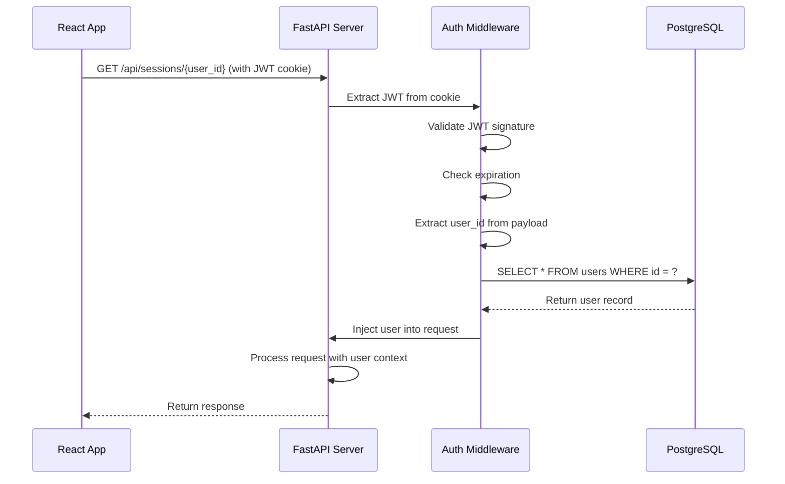

# Google OAuth2 Authentication - Design Document

## 🏗️ System Architecture

### High-Level Architecture

```
┌─────────────────────────────────────────────────────────────────┐
│                         FRONTEND (React)                        │
│  ┌────────────────────────────────────────────────────────────┐ │
│  │  Login Component (Google OAuth Button)                     │ │
│  └────────────────────────────────────────────────────────────┘ │
│  ┌────────────────────────────────────────────────────────────┐ │
│  │  AuthContext (Global Auth State)                           │ │
│  │  - user: {id, email}                                       │ │
│  │  - isAuthenticated: boolean                                │ │
│  │  - login(), logout(), checkAuth()                          │ │
│  └────────────────────────────────────────────────────────────┘ │
│  ┌────────────────────────────────────────────────────────────┐ │
│  │  Protected Routes                                          │ │
│  │  - ChatInterface (requires auth)                           │ │
│  │  - Sidebar (requires auth)                                 │ │
│  └────────────────────────────────────────────────────────────┘ │
│  ┌────────────────────────────────────────────────────────────┐ │
│  │  API Client (with credentials: 'include')                  │ │
│  │  - Automatic JWT cookie inclusion                          │ │
│  │  - 401 handling → redirect to login                        │ │
│  └────────────────────────────────────────────────────────────┘ │
└──────────────────────┬──────────────────────────────────────────┘
                       │ HTTP Requests (with cookies)
                       ▼
┌─────────────────────────────────────────────────────────────────┐
│                      BACKEND (FastAPI)                          │
│  ┌────────────────────────────────────────────────────────────┐ │
│  │  Auth Endpoints                                            │ │
│  │  - GET  /auth/google         (initiate OAuth)             │ │
│  │  - GET  /auth/google/callback (handle callback)           │ │
│  │  - POST /auth/logout         (clear cookie)               │ │
│  │  - GET  /auth/me             (get current user)           │ │
│  │  - GET  /auth/verify         (verify token)               │ │
│  └────────────────────────────────────────────────────────────┘ │
│  ┌────────────────────────────────────────────────────────────┐ │
│  │  Authentication Middleware                                 │ │
│  │  - Extract JWT from cookie                                 │ │
│  │  - Validate signature & expiration                         │ │
│  │  - Load user from database                                 │ │
│  │  - Inject user into request                                │ │
│  └────────────────────────────────────────────────────────────┘ │
│  ┌────────────────────────────────────────────────────────────┐ │
│  │  Protected Endpoints (Depends on auth middleware)          │ │
│  │  - /api/sessions                                           │ │
│  │  - /api/messages                                           │ │
│  │  - /query                                                  │ │
│  └────────────────────────────────────────────────────────────┘ │
└──────────────────────┬──────────────────────────────────────────┘
                       │
                       ▼
┌─────────────────────────────────────────────────────────────────┐
│                    EXTERNAL SERVICES                            │
│  ┌────────────────────────────────────────────────────────────┐ │
│  │  Google OAuth 2.0                                          │ │
│  │  - accounts.google.com                                     │ │
│  │  - Returns: ID token, access token                         │ │
│  └────────────────────────────────────────────────────────────┘ │
└─────────────────────────────────────────────────────────────────┘
                       │
                       ▼
┌─────────────────────────────────────────────────────────────────┐
│                    POSTGRESQL RDS                               │
│  ┌────────────────────────────────────────────────────────────┐ │
│  │  users table                                               │ │
│  │  - id (SERIAL PRIMARY KEY)                                 │ │
│  │  - email (VARCHAR UNIQUE)                                  │ │
│  │  - created_at, last_login                                  │ │
│  └────────────────────────────────────────────────────────────┘ │
│  ┌────────────────────────────────────────────────────────────┐ │
│  │  chat_sessions table                                       │ │
│  │  - user_id references users(id)                            │ │
│  └────────────────────────────────────────────────────────────┘ │
└─────────────────────────────────────────────────────────────────┘
```

---

## 🗄️ Database Design

### Schema Updates

```sql
-- New table: users
CREATE TABLE users (
    id SERIAL PRIMARY KEY,
    email VARCHAR(255) UNIQUE NOT NULL,
    created_at TIMESTAMP WITH TIME ZONE DEFAULT CURRENT_TIMESTAMP,
    last_login TIMESTAMP WITH TIME ZONE DEFAULT CURRENT_TIMESTAMP
);

-- Index for fast email lookup
CREATE INDEX idx_users_email ON users(email);

-- Update chat_sessions to reference users table
ALTER TABLE chat_sessions 
ADD COLUMN user_id_fk INTEGER REFERENCES users(id);

-- Migrate existing data (optional)
-- user_id (string) -> user_id_fk (integer reference)
```

### Data Model

#### User Model
```python
class User(Base):
    __tablename__ = "users"
    
    id = Column(Integer, primary_key=True, index=True)
    email = Column(String(255), unique=True, nullable=False, index=True)
    created_at = Column(TIMESTAMP(timezone=True), server_default=func.now())
    last_login = Column(TIMESTAMP(timezone=True), server_default=func.now(), onupdate=func.now())
    
    # Relationship to sessions
    sessions = relationship("ChatSession", back_populates="user")
```

#### Updated ChatSession Model
```python
class ChatSession(Base):
    __tablename__ = "chat_sessions"
    
    session_id = Column(String(33), primary_key=True)
    user_id = Column(String(100), nullable=False)  # Keep for backward compatibility
    user_id_fk = Column(Integer, ForeignKey("users.id"))  # New foreign key
    title = Column(String(255), default="New Chat")
    created_at = Column(TIMESTAMP(timezone=True), server_default=func.now())
    updated_at = Column(TIMESTAMP(timezone=True), server_default=func.now())
    
    # Relationship to user
    user = relationship("User", back_populates="sessions")
```

---

## 🔐 Authentication Flow Design

### 1. OAuth Login Flow

```mermaid
sequenceDiagram
    participant User as User Browser
    participant Frontend as React App
    participant Backend as FastAPI Server
    participant Google as Google OAuth
    participant DB as PostgreSQL

    User->>Frontend: Click "Sign in with Google"
    Frontend->>Backend: GET /auth/google
    Backend->>Backend: Generate state parameter
    Backend->>Backend: Build OAuth URL
    Backend-->>Frontend: Redirect to Google OAuth URL
    Frontend->>Google: Redirect user to consent screen
    User->>Google: Approve permissions
    Google->>Backend: Redirect to /auth/google/callback?code=...&state=...
    Backend->>Backend: Validate state parameter
    Backend->>Google: Exchange code for tokens
    Google-->>Backend: Return ID token + access token
    Backend->>Backend: Verify ID token signature
    Backend->>Backend: Extract email from ID token
    Backend->>DB: SELECT * FROM users WHERE email = ?
    alt User exists
        DB-->>Backend: Return user record
        Backend->>DB: UPDATE users SET last_login = NOW()
    else User does not exist
        Backend->>DB: INSERT INTO users (email)
        DB-->>Backend: Return new user record
    end
    Backend->>Backend: Generate JWT token
    Backend->>Frontend: Set-Cookie: sentra_jwt_token=...; HttpOnly
    Backend->>Frontend: Redirect to http://localhost:5173
    Frontend->>Backend: GET /auth/me (with cookie)
    Backend-->>Frontend: Return user data
    Frontend->>Frontend: Set auth state
    Frontend-->>User: Show ChatInterface
```

### 2. Protected Request Flow



### 3. Logout Flow

```mermaid
sequenceDiagram
    participant User as User Browser
    participant Frontend as React App
    participant Backend as FastAPI Server

    User->>Frontend: Click Logout
    Frontend->>Backend: POST /auth/logout (with JWT cookie)
    Backend->>Backend: Set-Cookie: sentra_jwt_token=; Max-Age=0
    Backend-->>Frontend: Return success
    Frontend->>Frontend: Clear auth state
    Frontend-->>User: Redirect to Login page
```

---

## 🔧 Backend Implementation Design

### Directory Structure

```
BackendAPI/
├── auth/
│   ├── __init__.py
│   ├── oauth.py           # Google OAuth handlers
│   ├── jwt_handler.py     # JWT generation & validation
│   ├── middleware.py      # Authentication middleware
│   └── dependencies.py    # FastAPI dependencies
├── models.py              # Updated with User model
├── database.py            # Database connection
├── Agent_Trigger.py       # Main app with auth routes
└── .env                   # Updated with OAuth/JWT config
```

### Key Components

#### 1. JWT Handler (`auth/jwt_handler.py`)

```python
import jwt
from datetime import datetime, timedelta
from typing import Optional, Dict

class JWTHandler:
    def __init__(self, secret_key: str, algorithm: str = "HS256"):
        self.secret_key = secret_key
        self.algorithm = algorithm
    
    def create_token(self, user_id: int, email: str, expires_delta: Optional[timedelta] = None) -> str:
        """Generate JWT token"""
        if expires_delta is None:
            expires_delta = timedelta(days=7)
        
        expire = datetime.utcnow() + expires_delta
        payload = {
            "sub": str(user_id),
            "email": email,
            "exp": expire,
            "iat": datetime.utcnow()
        }
        return jwt.encode(payload, self.secret_key, algorithm=self.algorithm)
    
    def verify_token(self, token: str) -> Optional[Dict]:
        """Verify and decode JWT token"""
        try:
            payload = jwt.decode(token, self.secret_key, algorithms=[self.algorithm])
            return payload
        except jwt.ExpiredSignatureError:
            return None  # Token expired
        except jwt.InvalidTokenError:
            return None  # Invalid token
```

#### 2. OAuth Handler (`auth/oauth.py`)

```python
from google.oauth2 import id_token
from google.auth.transport import requests
from google_auth_oauthlib.flow import Flow

class GoogleOAuthHandler:
    def __init__(self, client_id: str, client_secret: str, redirect_uri: str):
        self.client_id = client_id
        self.client_secret = client_secret
        self.redirect_uri = redirect_uri
        self.scopes = [
            "openid",
            "https://www.googleapis.com/auth/userinfo.email",
            "https://www.googleapis.com/auth/userinfo.profile"
        ]
    
    def get_authorization_url(self, state: str) -> str:
        """Generate Google OAuth authorization URL"""
        flow = Flow.from_client_config(
            {
                "web": {
                    "client_id": self.client_id,
                    "client_secret": self.client_secret,
                    "redirect_uris": [self.redirect_uri],
                    "auth_uri": "https://accounts.google.com/o/oauth2/auth",
                    "token_uri": "https://oauth2.googleapis.com/token"
                }
            },
            scopes=self.scopes,
            redirect_uri=self.redirect_uri
        )
        flow.state = state
        authorization_url, _ = flow.authorization_url(
            access_type='offline',
            include_granted_scopes='true',
            prompt='select_account'
        )
        return authorization_url
    
    def exchange_code(self, code: str, state: str) -> Dict:
        """Exchange authorization code for tokens"""
        flow = Flow.from_client_config(
            {
                "web": {
                    "client_id": self.client_id,
                    "client_secret": self.client_secret,
                    "redirect_uris": [self.redirect_uri],
                    "auth_uri": "https://accounts.google.com/o/oauth2/auth",
                    "token_uri": "https://oauth2.googleapis.com/token"
                }
            },
            scopes=self.scopes,
            redirect_uri=self.redirect_uri,
            state=state
        )
        flow.fetch_token(code=code)
        credentials = flow.credentials
        
        # Verify ID token
        id_info = id_token.verify_oauth2_token(
            credentials.id_token,
            requests.Request(),
            self.client_id
        )
        
        return {
            "email": id_info.get("email"),
            "name": id_info.get("name"),
            "picture": id_info.get("picture"),
            "sub": id_info.get("sub")  # Google user ID
        }
```

#### 3. Authentication Middleware (`auth/middleware.py`)

```python
from fastapi import Depends, HTTPException, status, Request
from fastapi.security import HTTPBearer
from sqlalchemy.orm import Session
from typing import Optional

security = HTTPBearer(auto_error=False)

async def get_current_user(
    request: Request,
    db: Session = Depends(get_db)
) -> User:
    """Extract and validate JWT from cookie, return current user"""
    
    # Extract JWT from cookie
    token = request.cookies.get("sentra_jwt_token")
    
    if not token:
        raise HTTPException(
            status_code=status.HTTP_401_UNAUTHORIZED,
            detail="Not authenticated"
        )
    
    # Verify token
    payload = jwt_handler.verify_token(token)
    if not payload:
        raise HTTPException(
            status_code=status.HTTP_401_UNAUTHORIZED,
            detail="Invalid or expired token"
        )
    
    # Get user from database
    user_id = int(payload.get("sub"))
    user = db.query(User).filter(User.id == user_id).first()
    
    if not user:
        raise HTTPException(
            status_code=status.HTTP_401_UNAUTHORIZED,
            detail="User not found"
        )
    
    return user
```

---

## 🎨 Frontend Implementation Design

### Directory Structure

```
Frontend/src/
├── contexts/
│   └── AuthContext.jsx     # Global auth state
├── components/
│   ├── Login.jsx           # Updated with Google button
│   ├── ProtectedRoute.jsx  # Route wrapper
│   └── ChatInterface.jsx   # Updated to use auth
├── services/
│   ├── authApi.js          # Auth API calls
│   └── chatApi.js          # Updated with auth
└── App.jsx                 # Updated with AuthProvider
```

### Key Components

#### 1. AuthContext (`contexts/AuthContext.jsx`)

```jsx
import { createContext, useContext, useState, useEffect } from 'react';
import Cookies from 'js-cookie';
import * as authApi from '../services/authApi';

const AuthContext = createContext(null);

export function AuthProvider({ children }) {
  const [user, setUser] = useState(null);
  const [loading, setLoading] = useState(true);
  const [isAuthenticated, setIsAuthenticated] = useState(false);

  useEffect(() => {
    checkAuth();
  }, []);

  const checkAuth = async () => {
    try {
      const token = Cookies.get('sentra_jwt_token');
      if (token) {
        const userData = await authApi.getCurrentUser();
        setUser(userData);
        setIsAuthenticated(true);
      }
    } catch (error) {
      console.error('Auth check failed:', error);
      setUser(null);
      setIsAuthenticated(false);
    } finally {
      setLoading(false);
    }
  };

  const login = () => {
    window.location.href = `${import.meta.env.VITE_API_URL}/auth/google`;
  };

  const logout = async () => {
    try {
      await authApi.logout();
      setUser(null);
      setIsAuthenticated(false);
      Cookies.remove('sentra_jwt_token');
    } catch (error) {
      console.error('Logout failed:', error);
    }
  };

  return (
    <AuthContext.Provider value={{ user, loading, isAuthenticated, login, logout, checkAuth }}>
      {children}
    </AuthContext.Provider>
  );
}

export const useAuth = () => useContext(AuthContext);
```

#### 2. Protected Route (`components/ProtectedRoute.jsx`)

```jsx
import { Navigate } from 'react-router-dom';
import { useAuth } from '../contexts/AuthContext';

function ProtectedRoute({ children }) {
  const { isAuthenticated, loading } = useAuth();

  if (loading) {
    return <div>Loading...</div>;
  }

  if (!isAuthenticated) {
    return <Navigate to="/login" replace />;
  }

  return children;
}

export default ProtectedRoute;
```

#### 3. Updated Login (`components/Login.jsx`)

```jsx
import { useAuth } from '../contexts/AuthContext';
import './Login.css';

function Login() {
  const { login } = useAuth();

  return (
    <div className="login-container">
      <div className="login-card">
        <h1>Sentra Insurance</h1>
        <p>Sign in to access your insurance assistant</p>
        <button onClick={login} className="google-signin-button">
          
          Sign in with Google
        </button>
      </div>
    </div>
  );
}

export default Login;
```

---

## 🔒 Security Design

### Cookie Configuration

```python
# Backend cookie settings
response.set_cookie(
    key="sentra_jwt_token",
    value=jwt_token,
    httponly=True,        # Prevent XSS attacks
    secure=True,          # HTTPS only (production)
    samesite="lax",       # CSRF protection
    max_age=604800,       # 7 days in seconds
    domain="localhost",   # Change for production
    path="/"              # Available on all routes
)
```

### JWT Payload Structure

```json
{
  "sub": "123",                      // User ID
  "email": "user@example.com",       // User email
  "iat": 1703001234,                 // Issued at
  "exp": 1703606034                  // Expires at (7 days later)
}
```

### CORS Configuration

```python
app.add_middleware(
    CORSMiddleware,
    allow_origins=["http://localhost:5173"],  # Frontend URL
    allow_credentials=True,                    # Allow cookies
    allow_methods=["*"],
    allow_headers=["*"],
)
```

---

## 📊 API Design

### Authentication Endpoints

#### GET /auth/google
- **Purpose**: Initiate OAuth flow
- **Response**: Redirect to Google consent screen
- **State**: Generate and store random state parameter

#### GET /auth/google/callback
- **Purpose**: Handle OAuth callback
- **Query Params**: code, state
- **Process**:
  1. Validate state parameter
  2. Exchange code for tokens
  3. Verify ID token
  4. Create/update user in database
  5. Generate JWT
  6. Set HTTP-only cookie
  7. Redirect to frontend

#### POST /auth/logout
- **Purpose**: Clear JWT cookie
- **Auth**: Required
- **Response**: Success message
- **Action**: Set cookie with Max-Age=0

#### GET /auth/me
- **Purpose**: Get current user info
- **Auth**: Required
- **Response**: `{ "id": 1, "email": "user@example.com" }`

#### GET /auth/verify
- **Purpose**: Verify JWT token
- **Auth**: Required
- **Response**: `{ "valid": true }`

---

## 🧪 Testing Strategy

### Unit Tests

```python
# test_jwt_handler.py
def test_create_token():
    handler = JWTHandler(secret_key="test-secret")
    token = handler.create_token(user_id=1, email="test@example.com")
    assert token is not None

def test_verify_valid_token():
    handler = JWTHandler(secret_key="test-secret")
    token = handler.create_token(user_id=1, email="test@example.com")
    payload = handler.verify_token(token)
    assert payload["sub"] == "1"
    assert payload["email"] == "test@example.com"

def test_verify_expired_token():
    handler = JWTHandler(secret_key="test-secret")
    token = handler.create_token(
        user_id=1,
        email="test@example.com",
        expires_delta=timedelta(seconds=-1)
    )
    payload = handler.verify_token(token)
    assert payload is None
```

### Integration Tests

```python
# test_auth_endpoints.py
def test_oauth_initiate(client):
    response = client.get("/auth/google")
    assert response.status_code == 307  # Redirect
    assert "accounts.google.com" in response.headers["location"]

def test_protected_endpoint_without_auth(client):
    response = client.get("/api/sessions/test_user")
    assert response.status_code == 401

def test_protected_endpoint_with_auth(client, auth_token):
    client.cookies.set("sentra_jwt_token", auth_token)
    response = client.get("/auth/me")
    assert response.status_code == 200
    assert "email" in response.json()
```

---

## 🚀 Deployment Considerations

### Environment Variables (Production)

```env
# Google OAuth2 (Production)
GOOGLE_CLIENT_ID=your-prod-client-id.apps.googleusercontent.com
GOOGLE_CLIENT_SECRET=your-prod-client-secret
GOOGLE_REDIRECT_URI=https://yourdomain.com/auth/google/callback

# JWT Configuration
JWT_SECRET_KEY=your-super-secure-random-key-min-64-chars-recommended
JWT_ALGORITHM=HS256
JWT_EXPIRATION_DAYS=7

# Cookie Configuration (Production)
COOKIE_DOMAIN=yourdomain.com
COOKIE_SECURE=True          # HTTPS only
COOKIE_SAMESITE=Lax
```

### HTTPS Requirements
- ✅ Use HTTPS in production
- ✅ Set `COOKIE_SECURE=True`
- ✅ Update Google OAuth redirect URI
- ✅ Update CORS origin to production URL

---

## 📋 Migration Plan

### Phase 1: Database Migration
1. Create users table
2. Populate users from existing user_ids
3. Add user_id_fk to chat_sessions
4. Create migration script for existing data

### Phase 2: Backend Deployment
1. Deploy auth endpoints
2. Keep existing endpoints backward compatible
3. Gradually migrate users to OAuth

### Phase 3: Frontend Migration
1. Deploy new Login with Google OAuth
2. Update API client
3. Test with new users
4. Migration path for existing users

---

**Status:** ✅ Design Complete - Ready for Implementation  
**Created:** December 2025  
**Version:** 1.0
