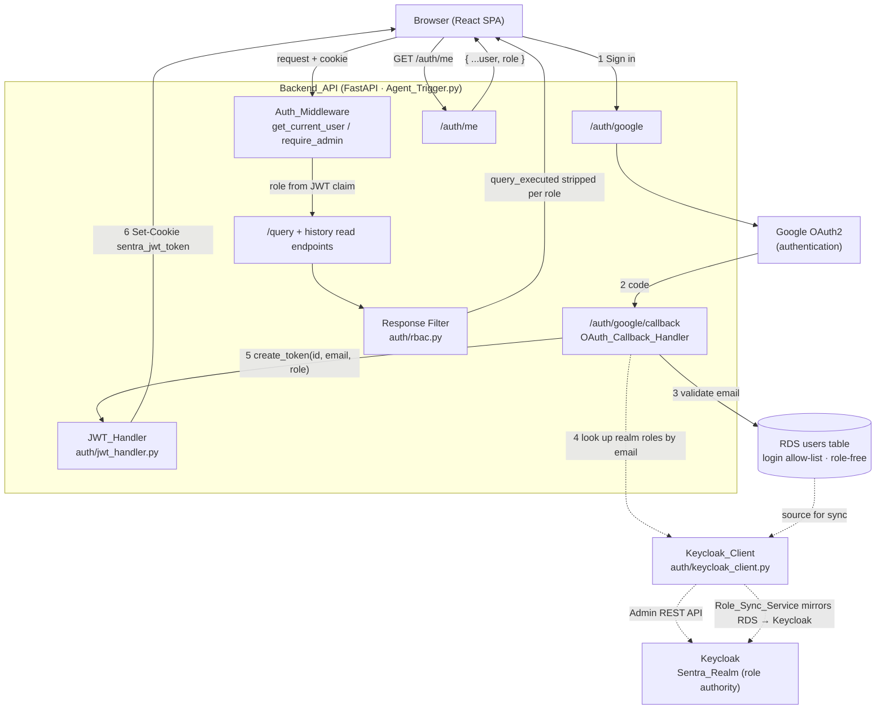

# Design Document

## Overview

This feature adds **Keycloak as a dedicated RBAC (role) authority** to the Sentra Banking & Insurance AI Chatbot. Keycloak sits *beside* the existing authentication flow — it is never on the sign-in path. Google OAuth2 remains the only way users authenticate, and the existing application JWT in the HTTP-only `sentra_jwt_token` cookie remains the only session credential.

The design splits two responsibilities that are easy to conflate:

- **Who may log in** stays with the RDS `users` table (`BackendAPI/models_v3.py` → `User`). It remains the login allow-list and stays **role-free** (no role column).
- **What role a user holds** moves to Keycloak. Authorized RDS users are mirrored into a dedicated Keycloak realm so each one can carry exactly one effective Sentra role.

The role is resolved **once per login**, during the existing `/auth/google/callback` handler in `BackendAPI/Agent_Trigger.py`: after the email is validated against RDS, the backend asks Keycloak for that email's realm roles and embeds the resolved role as a `role` claim in the application JWT (`auth/jwt_handler.py`). Every subsequent request reads the role straight from the verified JWT — no per-request Keycloak call.

Three roles exist:

| Role | Can view executed SQL (`query_executed`)? | Admin capabilities? |
|------|-------------------------------------------|---------------------|
| `admin` | Yes | Yes |
| `viewer_with_query` | Yes | No |
| `viewer_without_query` (default, least privilege) | No | No |

Enforcement is **dual**:

- **Server-side (authoritative):** the `/query` endpoint and every stored-history read endpoint strip `query_executed` for roles not permitted to see it; admin-only operations return `403` for non-admins.
- **Frontend (experience only):** `ChatMessage.jsx` hides the SQL "Query" tab based on the role exposed through `/auth/me`. The frontend trusts the backend as the real enforcement point.

The deprecated CIF_NO banking RBAC concept is **not** carried over. RBAC here is strictly (a) admin vs viewer capability and (b) visibility of the executed SQL query.

### Design Decisions and Rationale

| Decision | Rationale |
|----------|-----------|
| Resolve role at callback and embed in JWT (no second login) | Keeps Google SSO untouched (Req 1), avoids a Keycloak round-trip on every request, and means the role travels with the existing session credential. |
| RDS stays role-free | Single source of truth for roles is Keycloak (Req 3). Avoids drift between two role stores. |
| Default to `viewer_without_query` on any ambiguity | Least-privilege by default (Req 10): applies on missing Keycloak role, missing JWT claim, Keycloak unreachable, or kill-switch off. |
| Filter on read, never mutate stored data | `conversation_turns.assistant_response` keeps the full payload including `query_executed`; visibility is applied per-request based on the caller's role, so a role change takes effect immediately on existing history (Req 8.5). |
| `KEYCLOAK_ENABLED` kill-switch | Lets the feature ship dark / be disabled in an incident; when off, everyone gets the default role and requests still serve (Req 12.4). |

## Architecture

Keycloak is a **side authority**, not an auth gateway. The diagram below shows the authentication path (solid) and the role-authority interaction (dashed). The dashed Keycloak call happens only during the callback.



Key points:

- Google is the only box on the sign-in path. Keycloak never sees a user credential.
- The single dashed call from `Callback` to `KCClient` (step 4) is the *only* place a user-facing request touches Keycloak. It is wrapped so any failure degrades to the default role.
- The `Role_Sync_Service` is an offline/admin-triggered path that mirrors RDS users into Keycloak; it is not on any user request path.

### Module Layout (new and modified)

```
(project root)
├── docker-compose.keycloak.yml    # NEW: local Keycloak + Postgres dev environment
├── keycloak/
│   └── realm-export.json          # NEW: pre-configured sentra realm (auto-imported on first boot)

BackendAPI/
├── auth/
│   ├── roles.py              # NEW: Role enum, ROLE_PRIORITY, DEFAULT_ROLE, helpers
│   ├── keycloak_client.py    # NEW: Keycloak Admin REST API client (role lookup, user create, role assign)
│   ├── rbac.py               # NEW: response filtering + query-visibility helpers
│   ├── jwt_handler.py        # MODIFIED: add `role` claim to create_token / verify_token
│   └── middleware.py         # MODIFIED: resolve role from claim, expose it, add require_admin
├── role_sync.py              # NEW: Role_Sync_Service CLI/module (RDS → Keycloak mirror)
├── add_authorized_user.py    # MODIFIED (optional hook): create Keycloak user on add
└── Agent_Trigger.py          # MODIFIED: callback role lookup, response filtering, /auth/me role, admin endpoints

Frontend/src/
├── contexts/AuthContext.jsx  # MODIFIED: expose `role`
├── services/authApi.js       # (unchanged shape; /auth/me now returns role)
└── components/ChatMessage.jsx # MODIFIED: gate Query tab on role
```

## Components and Interfaces

### 1. Keycloak Realm and Role Configuration (Req 2)

A dedicated realm (the **Sentra_Realm**) holds Sentra users and three **realm roles**:

- `admin`
- `viewer_with_query`
- `viewer_without_query`

A confidential **client** with a **service account** is created in the realm for the backend. The service account is granted the `realm-management` client roles needed for the operations below: `view-users`, `query-users`, `manage-users`, and `view-realm` (to read role definitions). The backend authenticates to Keycloak using the **client credentials grant** — never a user password.

Environment variables (read in `database.py`-style via `os.getenv`, consistent with existing config):

| Variable | Purpose | Example |
|----------|---------|---------|
| `KEYCLOAK_URL` | Base URL of the Keycloak server | `https://keycloak.internal:8443` |
| `KEYCLOAK_REALM` | Realm name (Sentra_Realm) | `sentra` |
| `KEYCLOAK_CLIENT_ID` | Confidential client id for the backend service account | `sentra-backend` |
| `KEYCLOAK_CLIENT_SECRET` | Client secret for the service account | `••••••` |
| `KEYCLOAK_ENABLED` | Kill-switch. When not `"True"`, all role lookups return the default role and no network call is made | `True` |

These are added to `BackendAPI/.env` and `.env.example`. No secret values are committed.

### 1a. Local Development Setup — Docker Compose

For local development, Keycloak runs as a Docker container alongside a dedicated PostgreSQL instance (Keycloak's own persistence — separate from the Sentra RDS). A `docker-compose.keycloak.yml` at the project root provides a one-command setup.

```yaml
# docker-compose.keycloak.yml
version: "3.9"

services:
  keycloak-db:
    image: postgres:15-alpine
    container_name: sentra-keycloak-db
    environment:
      POSTGRES_DB: keycloak
      POSTGRES_USER: keycloak
      POSTGRES_PASSWORD: keycloak_dev_password
    volumes:
      - keycloak_pg_data:/var/lib/postgresql/data
    ports:
      - "5433:5432"   # 5433 to avoid collision with Sentra RDS tunnel on 5432
    healthcheck:
      test: ["CMD-SHELL", "pg_isready -U keycloak"]
      interval: 5s
      timeout: 3s
      retries: 5

  keycloak:
    image: quay.io/keycloak/keycloak:25.0
    container_name: sentra-keycloak
    command: start-dev --import-realm
    environment:
      # Admin console credentials (dev only)
      KEYCLOAK_ADMIN: admin
      KEYCLOAK_ADMIN_PASSWORD: admin
      # Database connection (to keycloak-db container)
      KC_DB: postgres
      KC_DB_URL: jdbc:postgresql://keycloak-db:5432/keycloak
      KC_DB_USERNAME: keycloak
      KC_DB_PASSWORD: keycloak_dev_password
      # Dev mode settings
      KC_HOSTNAME_STRICT: "false"
      KC_HTTP_ENABLED: "true"
    ports:
      - "8080:8080"    # Keycloak UI + Admin REST API
    volumes:
      - ./keycloak/realm-export.json:/opt/keycloak/data/import/sentra-realm.json:ro
    depends_on:
      keycloak-db:
        condition: service_healthy

volumes:
  keycloak_pg_data:
```

**Usage:**

```bash
# Start Keycloak (first run takes ~30s to pull images)
docker compose -f docker-compose.keycloak.yml up -d

# Verify it's running
curl http://localhost:8080/health/ready

# Access admin console (dev credentials: admin/admin)
# http://localhost:8080/admin

# Stop
docker compose -f docker-compose.keycloak.yml down

# Stop and wipe data (reset realm)
docker compose -f docker-compose.keycloak.yml down -v
```

**Auto-imported realm configuration** (`keycloak/realm-export.json`):

The `--import-realm` flag loads a pre-configured `sentra` realm on first boot. This JSON export contains:

- Realm name: `sentra`
- Three realm roles: `admin`, `viewer_with_query`, `viewer_without_query`
- A confidential client `sentra-backend` with:
  - Service account enabled
  - Client credentials grant type
  - Service account roles: `realm-management` → `view-users`, `query-users`, `manage-users`, `view-realm`
  - Client secret: `sentra-dev-secret` (dev-only, overridden in production via `KEYCLOAK_CLIENT_SECRET` env var)

This means after `docker compose up`, the Keycloak realm is fully ready for the backend to connect — no manual admin console setup required for development.

**Corresponding local `.env` values:**

```bash
# Keycloak (local Docker)
KEYCLOAK_URL=http://localhost:8080
KEYCLOAK_REALM=sentra
KEYCLOAK_CLIENT_ID=sentra-backend
KEYCLOAK_CLIENT_SECRET=sentra-dev-secret
KEYCLOAK_ENABLED=True
```

**Production note:** In production, Keycloak would be hosted on EC2/ECS/Fargate in the same VPC as the Sentra backend (ap-south-1), using the existing Sentra RDS or a dedicated RDS instance for Keycloak's persistence. The Docker Compose setup is strictly for local development and CI.

### 2. `auth/roles.py` — Role definitions (Req 2, 5.5, 6.2, 10.1)

The single place that defines the role vocabulary and priority ordering. Implemented with a `str`-based `Enum` so values serialize directly into the JWT and compare cleanly against Keycloak strings.

```python
from enum import Enum

class Role(str, Enum):
    ADMIN = "admin"
    VIEWER_WITH_QUERY = "viewer_with_query"
    VIEWER_WITHOUT_QUERY = "viewer_without_query"

DEFAULT_ROLE = Role.VIEWER_WITHOUT_QUERY

# Most-privileged first. Used for both selection and validation.
ROLE_PRIORITY = [Role.ADMIN, Role.VIEWER_WITH_QUERY, Role.VIEWER_WITHOUT_QUERY]

def select_most_privileged(role_names: list[str]) -> Role:
    """Map a list of Keycloak realm-role strings to the single effective Sentra role.
    Ignores non-Sentra roles. Returns DEFAULT_ROLE if none match (Req 5.3, 5.5, 10.2)."""
    present = {r for r in role_names}
    for role in ROLE_PRIORITY:          # admin > viewer_with_query > viewer_without_query
        if role.value in present:
            return role
    return DEFAULT_ROLE

def coerce_role(value: str | None) -> Role:
    """Validate an arbitrary string (e.g. a JWT claim) into a Role.
    Unknown/missing → DEFAULT_ROLE (Req 6.3, 10.2)."""
    try:
        return Role(value)
    except (ValueError, TypeError):
        return DEFAULT_ROLE

def can_view_query(role: Role) -> bool:
    """Query visibility rule (Req 8.1–8.3, 10.3)."""
    return role in (Role.ADMIN, Role.VIEWER_WITH_QUERY)
```

### 3. `auth/keycloak_client.py` — Keycloak Admin REST client (Req 2.4, 4, 5.1)

A thin client over the Keycloak Admin REST API using the already-available `requests` library (no new heavy dependency; `python-keycloak` is an acceptable alternative but not required). Responsibilities: obtain a service-account token, look up a user by email, read realm-role mappings, create a user, and assign a realm role.

```python
class KeycloakClient:
    def __init__(self):
        self.base_url = os.getenv("KEYCLOAK_URL")
        self.realm = os.getenv("KEYCLOAK_REALM")
        self.client_id = os.getenv("KEYCLOAK_CLIENT_ID")
        self.client_secret = os.getenv("KEYCLOAK_CLIENT_SECRET")
        self.enabled = os.getenv("KEYCLOAK_ENABLED", "False") == "True"

    def is_enabled(self) -> bool: ...

    def _service_token(self) -> str:
        """POST {base}/realms/{realm}/protocol/openid-connect/token
        grant_type=client_credentials. Cached until near expiry."""

    def get_realm_roles_for_email(self, email: str) -> list[str]:
        """Returns the user's realm-role names, or [] if the user/roles are absent.
        Raises KeycloakUnavailable on transport/HTTP errors so callers can default."""
        # GET /admin/realms/{realm}/users?email={email}&exact=true  -> user id
        # GET /admin/realms/{realm}/users/{id}/role-mappings/realm   -> [{name}, ...]

    def user_exists(self, email: str) -> bool: ...

    def create_user(self, email: str) -> str:
        """POST /admin/realms/{realm}/users {username,email,enabled:true}. Returns new user id."""

    def assign_realm_role(self, user_id: str, role: Role) -> None:
        """GET /admin/realms/{realm}/roles/{role} then
        POST /admin/realms/{realm}/users/{id}/role-mappings/realm [roleRep]."""
```

A dedicated `KeycloakUnavailable` exception distinguishes "Keycloak said no roles" (returns `[]` → default) from "could not reach Keycloak" (raised → caller defaults *and* logs the failure, Req 5.4).

High-level role resolver used by the callback:

```python
def resolve_role_for_email(email: str, client: KeycloakClient) -> Role:
    if not client.is_enabled():
        return DEFAULT_ROLE                      # kill-switch (Req 12.4)
    try:
        names = client.get_realm_roles_for_email(email)
    except KeycloakUnavailable as e:
        logger.warning("Keycloak role lookup failed for %s: %s", email, e)  # Req 5.4
        return DEFAULT_ROLE
    return select_most_privileged(names)         # Req 5.2, 5.3, 5.5
```

### 4. `role_sync.py` — Role_Sync_Service (Req 4, 12.1)

A module + CLI that mirrors authorized RDS users into Keycloak. It is **idempotent**: existing Keycloak users are skipped and their role assignments are left untouched; only missing users are created and given the default role.

```python
def sync_users(client: KeycloakClient, db) -> dict:
    created, skipped, errors = 0, 0, []
    for user in db.query(User).all():            # RDS is the source list (Req 4.2)
        try:
            if client.user_exists(user.email):
                skipped += 1                      # leave existing role unchanged (Req 4.3)
                continue
            uid = client.create_user(user.email)  # (Req 4.1)
            client.assign_realm_role(uid, DEFAULT_ROLE)  # (Req 4.4, 12.1)
            created += 1
        except KeycloakUnavailable as e:
            errors.append((user.email, str(e)))   # (Req 4.5)
    summary = {"created": created, "skipped": skipped, "errors": errors}  # (Req 4.6)
    logger.info("Keycloak sync summary: %s", summary)
    return summary
```

CLI usage mirrors `add_authorized_user.py` conventions:

```bash
python role_sync.py sync     # mirror all RDS users into Keycloak (idempotent)
```

**Relationship to `add_authorized_user.py`:** that script remains the authority for adding/removing *login* rights in RDS. It gains an optional post-add hook that calls `KeycloakClient.create_user(email)` + `assign_realm_role(..., DEFAULT_ROLE)` so a freshly authorized user immediately has a Keycloak record. The bulk `role_sync.py` handles backfill for users added before this feature and is the operation triggered by the admin sync endpoint.

### 5. `auth/jwt_handler.py` — JWT changes (Req 6)

`create_token` gains a `role` parameter and writes the `role` claim; the existing claims are preserved unchanged. `verify_token` is unchanged in mechanics (claim defaulting is handled in the middleware via `coerce_role`, keeping verify focused on signature/expiry), but the design treats a missing `role` claim as the default everywhere it is read (Req 6.3).

```python
def create_token(self, user_id: int, email: str, role: str = DEFAULT_ROLE.value) -> str:
    payload = {
        "sub": str(user_id),
        "email": email,
        "role": role,            # NEW (Req 6.1, 6.2)
        "exp": expire,
        "iat": datetime.utcnow(),
    }
    return jwt.encode(payload, self.secret_key, algorithm=self.algorithm)
```

The signing algorithm/secret and `sub`/`email`/`exp`/`iat` claims are unchanged (Req 6.4, 6.5). The default argument keeps any internal caller that omits a role safe-by-default.

### 6. `auth/middleware.py` — role-aware auth context (Req 7, 9)

`get_current_user` continues to return the `User` (so the dozens of existing `current_user: User = Depends(get_current_user)` handlers keep working), but now **resolves the role from the JWT claim and attaches it to the returned instance** as a transient attribute `current_user.role` (a `Role`). This is the lowest-churn way to satisfy "make the role available to handlers" while keeping RDS role-free (the role is never read from or written to the DB — Req 7.4).

```python
async def get_current_user(request, db=Depends(get_db)) -> User:
    token = request.cookies.get("sentra_jwt_token")
    if not token:
        raise HTTPException(401, "Not authenticated")
    payload = jwt_handler.verify_token(token)
    if not payload:
        raise HTTPException(401, "Invalid or expired token")     # Req 7.3
    user = db.query(User).filter(User.id == int(payload["sub"])).first()
    if not user:
        raise HTTPException(401, "User not found")
    user.role = coerce_role(payload.get("role"))                  # Req 7.1, 6.3, 10.2
    return user
```

A reusable admin guard for the admin-only endpoints (Req 9.2–9.5):

```python
async def require_admin(current_user: User = Depends(get_current_user)) -> User:
    if current_user.role != Role.ADMIN:
        raise HTTPException(403, "Admin privileges required for this operation")  # Req 9.3, 9.4
    return current_user
```

> Note: attaching `role` to the SQLAlchemy `User` instance is a transient, per-request attribute and is never persisted. If a stricter separation is preferred, an `AuthContext` dataclass (`user`, `role`) returned by a new `get_auth_context` dependency is a drop-in alternative; the attach approach is chosen to avoid editing every existing endpoint signature.

### 7. `auth/rbac.py` — response filtering (Req 8, 10.3)

A single, pure filtering function is the heart of authoritative enforcement. It is applied identically to live `/query` responses and to every stored-history payload, guaranteeing the "same rule for live and stored" requirement (Req 8.5).

```python
QUERY_FIELD = "query_executed"

def filter_response_for_role(payload: dict, role: Role) -> dict:
    """Return a shallow copy of an assistant response with query_executed removed
    when the role may not view it. Non-dict / missing-field inputs pass through."""
    if not isinstance(payload, dict):
        return payload
    if can_view_query(role):
        return payload                       # admin / viewer_with_query (Req 8.2, 8.3)
    if QUERY_FIELD not in payload:
        return payload
    cleaned = dict(payload)
    cleaned.pop(QUERY_FIELD, None)           # viewer_without_query (Req 8.1, 10.3)
    return cleaned

def filter_messages_for_role(messages: list, role: Role) -> list:
    """Apply the rule to to_message_format() output: only bot messages carry a dict content."""
    out = []
    for m in messages:
        if isinstance(m, dict) and isinstance(m.get("content"), dict):
            m = {**m, "content": filter_response_for_role(m["content"], role)}
        out.append(m)
    return out
```

This function **does not mutate** the stored `assistant_response`; it returns a filtered copy at serialization time so a later role change is reflected on existing history without a data migration.

### 8. `Agent_Trigger.py` — wiring it together

**Modified `/auth/google/callback` (Req 5, 1):** unchanged Google + RDS logic; after RDS validation and before token creation, resolve the role and pass it to `create_token`. All cookie attributes are untouched (Req 1.6).

```python
user.last_login = datetime.now(timezone.utc); db.commit()
role = resolve_role_for_email(user.email, keycloak_client)   # Req 5.1–5.5
token = jwt_handler.create_token(user.id, user.email, role.value)  # Req 6.1
# ... existing set_cookie(...) unchanged ...
```

**Modified `/query` (Req 8.1–8.4):** before returning, filter the response by the caller's role.

```python
response_data['session_id'] = session_id_str
response_data['turn_number'] = turn_number
return filter_response_for_role(response_data, current_user.role)
```

The full unfiltered `response_data` is still persisted to `conversation_turns.assistant_response` (filtering is read-time only).

**Modified history read endpoints (Req 8.5):** `/api/sessions/{session_id}/turns`, `/turns/raw`, and `/messages` apply the same filter to every emitted payload:

- `/turns` and `/messages` (message format): wrap the assembled list with `filter_messages_for_role(messages, current_user.role)`.
- `/turns/raw` (turn dicts): map each `turn.to_dict()` and filter its `assistant_response` field via `filter_response_for_role`.

**Modified `/auth/me` (Req 7.2):** include the role.

```python
@app.get("/auth/me")
async def auth_me(current_user: User = Depends(get_current_user)):
    return {**current_user.to_dict(), "role": current_user.role.value}
```

**New admin endpoints (Req 9.1):** the admin capability set is exactly: see `query_executed` on all responses (inherent to the `admin` role via the filter), list all authorized users, and trigger a sync run.

```python
@app.get("/admin/users")
async def list_users(admin: User = Depends(require_admin), db=Depends(get_db)):
    return [u.to_dict() for u in db.query(User).all()]      # Req 9.1, 9.2

@app.post("/admin/keycloak/sync")
async def trigger_sync(admin: User = Depends(require_admin), db=Depends(get_db)):
    return sync_users(keycloak_client, db)                  # Req 9.1, 9.2
```

Non-admins hitting these receive `403` via `require_admin` (Req 9.3, 10.4).

### 9. Frontend changes

**`AuthContext.jsx` (Req 11.1):** `/auth/me` now returns `role`, so `user.role` is already present on the `user` object stored in context. A convenience `role` value is also exposed for components that don't want to reach into `user`.

```jsx
const userData = await authApi.getCurrentUser(); // now includes { ..., role }
setUser(userData);
// expose role alongside user
<AuthContext.Provider value={{ user, role: userData?.role, loading, isAuthenticated, login, logout, checkAuth }}>
```

**`authApi.js`:** no shape change required — `getCurrentUser()` already returns the parsed `/auth/me` JSON, which now carries `role`. (Documented so consumers know the field exists.)

**`ChatMessage.jsx` (Req 11.2, 11.3, 11.5):** the Query tab is currently gated only on `content.query_executed`. It becomes gated on **both** the presence of `query_executed` **and** the role permitting query view. Because the backend already strips `query_executed` for `viewer_without_query`, the existing `content.query_executed` check is the primary gate; the role check is defense-in-depth and avoids briefly rendering a tab if a stale payload is present.

```jsx
import { useAuth } from '../contexts/AuthContext'
// ...
const { role } = useAuth()
const canViewQuery = role === 'admin' || role === 'viewer_with_query'
const showQueryTab = canViewQuery && !!content.query_executed
// replace each `content.query_executed &&` tab guard with `showQueryTab &&`
// and guard the active-tab body render the same way
```

The frontend explicitly treats the backend as authoritative (Req 11.4): hiding is cosmetic and never the only barrier.

## Data Models

### Role (application enum)

Defined in `auth/roles.py` as the `Role(str, Enum)` above. Allowed values: `admin`, `viewer_with_query`, `viewer_without_query`. `DEFAULT_ROLE = viewer_without_query`. Priority order (most → least privileged): `admin`, `viewer_with_query`, `viewer_without_query`.

### JWT claim shape

The application JWT (HS256, in `sentra_jwt_token` cookie) gains one claim:

```json
{
  "sub": "42",
  "email": "user@example.com",
  "role": "viewer_with_query",
  "iat": 1730000000,
  "exp": 1730604800
}
```

- `role` ∈ {`admin`, `viewer_with_query`, `viewer_without_query`}.
- A token **without** `role` (legacy session issued before this feature) is treated as `viewer_without_query` at read time (Req 6.3, 12.2).

### RDS schema — unchanged (Req 3.2)

The `users` table (`models_v3.py` → `User`) is **not modified**. No role column is added. It continues to hold `id`, `email`, `created_at`, `last_login` and remains solely the login allow-list. Roles live only in Keycloak and in the per-session JWT claim.

```
users (UNCHANGED)
├── id           SERIAL PK
├── email        VARCHAR(255) UNIQUE NOT NULL
├── created_at   TIMESTAMPTZ
└── last_login   TIMESTAMPTZ
```

### Keycloak data (external)

- Realm: `KEYCLOAK_REALM` (Sentra_Realm).
- Realm roles: `admin`, `viewer_with_query`, `viewer_without_query`.
- Users: one Keycloak user per authorized RDS email (matched by email), each with zero or more realm-role mappings. Zero Sentra roles ⇒ effective role is the default.

## Correctness Properties

*A property is a characteristic or behavior that should hold true across all valid executions of a system — essentially, a formal statement about what the system should do. Properties serve as the bridge between human-readable specifications and machine-verifiable correctness guarantees.*

The properties below were derived from the acceptance criteria prework. Several criteria collapse into one property (e.g., all role-selection criteria describe a single `select_most_privileged` behavior; all per-role filtering criteria describe a single filter function). Pure logic in `auth/roles.py`, `auth/rbac.py`, `auth/jwt_handler.py`, and the `role_sync` accounting is the target — Keycloak and RDS are replaced with in-memory fakes so iterations are cheap.

### Property 1: Most-privileged role resolution

*For any* list of role-name strings (in any order, with duplicates or non-Sentra noise mixed in), `select_most_privileged` returns `admin` if `admin` is present, otherwise `viewer_with_query` if present, otherwise `viewer_without_query` if present, otherwise the `DEFAULT_ROLE` (`viewer_without_query`); and the result is invariant under permutation of the input list.

**Validates: Requirements 3.3, 5.2, 5.3, 5.5, 10.2**

### Property 2: Missing or invalid role claim resolves to the default role

*For any* JWT payload whose `role` claim is absent, `null`, or any string that is not one of the three Sentra roles, `coerce_role` resolves the effective role to `DEFAULT_ROLE` (`viewer_without_query`); and for any valid role string it resolves to exactly that role. (This is also the value the middleware attaches as `current_user.role`, so the exposed role always tracks the claim.)

**Validates: Requirements 6.3, 7.1, 7.4, 12.2**

### Property 3: JWT role round-trip preserves all claims

*For any* user id, email, and Sentra role, decoding the token produced by `create_token(id, email, role)` with the configured secret and algorithm yields `sub == str(id)`, the same `email`, a `role` claim equal to the input role (always one of the three allowed values), and `exp > iat`; and verification fails when attempted with a different secret.

**Validates: Requirements 6.1, 6.2, 6.4, 6.5**

### Property 4: Query visibility filtering by role

*For any* assistant-response dictionary and any role, `filter_response_for_role`:
- returns a payload **equal to the input** (including `query_executed` if present) when the role is `admin` or `viewer_with_query`; and
- returns a payload that **does not contain** the `query_executed` key (with all other fields preserved) when the role is `viewer_without_query` (the default role).

**Validates: Requirements 8.1, 8.2, 8.3, 10.3**

### Property 5: Live and stored responses are filtered identically

*For any* assistant-response dictionary and any role, applying `filter_response_for_role` to the live `/query` payload yields the same query visibility as filtering the same payload after it has passed through the stored-history serialization path (`to_message_format` / `to_dict` → `filter_messages_for_role`). That is, a user sees exactly the same presence/absence of `query_executed` whether the response is fresh or replayed from history.

**Validates: Requirements 8.5**

### Property 6: Synchronization covers all RDS users and defaults new ones

*For any* set of RDS user emails and any subset already present in a fake Keycloak, after `sync_users` runs every RDS email exists as a Keycloak user, and every user that was newly created during the run holds exactly the `DEFAULT_ROLE`.

**Validates: Requirements 4.1, 4.4, 12.1**

### Property 7: Synchronization is idempotent for existing users

*For any* set of pre-existing Keycloak users with arbitrary assigned roles, running `sync_users` (once or repeatedly) leaves those users' role assignments unchanged and creates no duplicate Keycloak user for an already-present email.

**Validates: Requirements 4.3**

### Property 8: Synchronization accounting is exact

*For any* set of RDS emails and any pre-existing subset in a fake Keycloak, the returned summary satisfies `created == |emails not previously in Keycloak|` and `skipped == |emails already in Keycloak|`, and `created + skipped` equals the number of RDS users processed without error.

**Validates: Requirements 4.6**

### Property 9: Non-admin roles are denied admin operations

*For any* role that is not `admin` (i.e., `viewer_with_query` or `viewer_without_query`, which includes the default role), invoking `require_admin` raises an HTTP 403 error; and for `admin` it returns the user without error.

**Validates: Requirements 9.2, 9.3, 9.5, 10.4**

### Property 10: Disabled Keycloak always yields the default role without a network call

*For any* email, when `KEYCLOAK_ENABLED` is off, `resolve_role_for_email` returns `DEFAULT_ROLE` and performs no Keycloak request, regardless of any role data that might exist in Keycloak.

**Validates: Requirements 12.4**

## Error Handling

| Condition | Handling | Requirement |
|-----------|----------|-------------|
| Keycloak unreachable during callback role lookup | `KeycloakClient.get_realm_roles_for_email` raises `KeycloakUnavailable`; `resolve_role_for_email` catches it, logs a warning (`logger.warning("Keycloak role lookup failed ...")`), and returns `DEFAULT_ROLE`. Login still succeeds. | 5.4 |
| Keycloak unreachable during sync | `sync_users` catches `KeycloakUnavailable` per user, appends `(email, message)` to `summary["errors"]`, and continues; the run reports a descriptive error list rather than crashing. | 4.5 |
| `KEYCLOAK_ENABLED` off (kill-switch) | No Keycloak calls are made anywhere on the request path; every user resolves to `DEFAULT_ROLE` and requests are served normally. Sync, if invoked, reports that integration is disabled. | 12.4 |
| JWT missing or invalid | `get_current_user` raises `HTTPException(401)` exactly as today (no behavior change). | 7.3 |
| JWT present but `role` claim missing/invalid (legacy session) | `coerce_role` returns `DEFAULT_ROLE`; the session operates at least privilege until the next sign-in re-mints the token with a role claim. | 6.3, 12.2 |
| Non-admin calls an admin-only endpoint | `require_admin` raises `HTTPException(403, "Admin privileges required for this operation")`. | 9.3, 9.4 |
| Keycloak service-account token expired | `KeycloakClient` transparently re-fetches a client-credentials token before the call; a hard failure surfaces as `KeycloakUnavailable` and degrades per the rows above. | 2.4 |
| Malformed/non-dict `assistant_response` in storage | `filter_response_for_role` passes non-dict input through unchanged, so history reads never crash on legacy/edge payloads. | 8.5 |

Logging uses the existing module logger pattern (`logging.getLogger(__name__)`). Role-lookup and sync failures are logged at WARNING with the email and error, but **no secrets** (client secret, tokens) are ever logged.

## Testing Strategy

### Dual approach

- **Property-based tests** verify the universal properties above across many generated inputs. The pure logic (`auth/roles.py`, `auth/rbac.py`, `auth/jwt_handler.py`, `role_sync` against a fake Keycloak) is ideal for PBT because behavior varies meaningfully with input (arbitrary role lists, arbitrary response payloads, arbitrary user sets) and iterations are cheap (no real network/AWS calls).
- **Example/unit tests** cover specific behaviors and edge cases: the callback issuing the cookie (1.2), authorized redirect (1.4), access-denied redirect (1.5), cookie attribute preservation (1.6), `/auth/me` shape (7.2), the 401 path (7.3), the Keycloak-unavailable fallbacks (4.5, 5.4), and the 403 message (9.4).
- **Integration tests** (1–3 examples, against a test realm or a mock Keycloak) cover external wiring that does not vary with input: service-account authentication (2.4), realm role existence (2.1–2.3), and the role-change-takes-effect-next-login flow (12.3).
- **Frontend component tests** (React Testing Library) cover role-aware rendering: Query tab hidden for `viewer_without_query` even if a stray `query_executed` is present (11.2), shown for `admin`/`viewer_with_query` when present (11.3), and absent when the field is missing (11.5); plus context exposure of `role` (11.1).
- **Schema test** asserts the RDS `User` model exposes no role attribute and the `users` table has no role column (3.2).

### Property-based testing library and configuration

- **Library:** [Hypothesis](https://hypothesis.readthedocs.io/) for the Python backend (do not hand-roll generators). For the optional frontend property checks, [fast-check](https://github.com/dubzzz/fast-check) with Vitest.
- **Iterations:** each property test runs a **minimum of 100 iterations** (`@settings(max_examples=100)` in Hypothesis).
- **Generators:**
  - role-name lists: draw from the three Sentra role strings plus arbitrary "noise" strings, with shuffling and duplicates, including the empty list;
  - response payloads: dictionaries with arbitrary keys/values, sometimes including `query_executed` with arbitrary string content, including non-`dict` inputs for the robustness edge case;
  - JWT inputs: arbitrary positive ints (id), email-like strings, and a role drawn from the `Role` enum;
  - sync inputs: arbitrary sets of unique emails partitioned into "pre-existing in fake Keycloak" and "new", with pre-existing users carrying arbitrary role assignments.
- **Fakes/mocks:** an in-memory `FakeKeycloak` implementing the `KeycloakClient` surface (`user_exists`, `create_user`, `assign_realm_role`, `get_realm_roles_for_email`) backs the role-resolution and sync property tests; a failing variant raises `KeycloakUnavailable` for the error-condition edge cases. No AWS, no real Keycloak, no real RDS in property tests.
- **Tagging:** each property test is tagged with a comment referencing its design property, in the format:
  `# Feature: keycloak-rbac-integration, Property {number}: {property_text}`
- **One test per property:** each of Properties 1–10 is implemented by a single property-based test.

### Coverage mapping

| Property | Test target |
|----------|-------------|
| P1 | `select_most_privileged` over arbitrary role lists |
| P2 | `coerce_role` over missing/invalid/valid claims (and middleware attach) |
| P3 | `create_token` → decode round-trip |
| P4 | `filter_response_for_role` over arbitrary payloads × roles |
| P5 | live vs `filter_messages_for_role`/`to_dict` path equivalence |
| P6, P7, P8 | `sync_users` against `FakeKeycloak` |
| P9 | `require_admin` over all roles |
| P10 | `resolve_role_for_email` with `KEYCLOAK_ENABLED` off (assert no call via spy) |

Non-property requirements (Section "Example/unit", "Integration", "Frontend") are covered by the example, integration, and component tests listed above.
