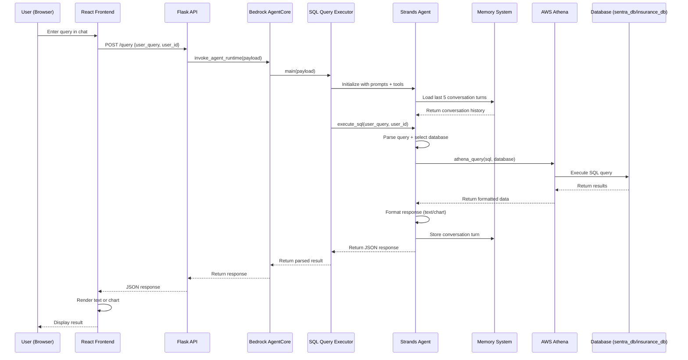

# Sentra Banking & Insurance AI Chatbot - Project Guide

## Project Overview

**Sentra** is an AI-powered banking and insurance chatbot system that enables users to query banking and insurance data through natural language. The system uses AWS Bedrock Agent Core with Claude Sonnet 4 to generate SQL queries against AWS Athena databases and return results in both text and visual formats (charts).

**Key Features:**
- Natural language to SQL query generation
- Dual database support (banking + insurance)
- Role-based access control (RBAC)
- Chart visualizations (bar, line, pie, scatter)
- Conversation memory
- React frontend with chat interface

## Architecture Overview

```
┌─────────────────────────────────────────────────────────────────┐
│                         USER INTERFACE                          │
│                    (React Frontend - Vite)                      │
│  - Login/Authentication                                         │
│  - Chat Interface                                               │
│  - Chart Rendering (Recharts)                                   │
│  - Customer List View                                           │
└────────────────────┬────────────────────────────────────────────┘
                     │ HTTP POST /query
                     │ {user_query, user_id}
                     ▼
┌─────────────────────────────────────────────────────────────────┐
│                      FLASK API LAYER                            │
│                   (Backend/Agent_Trigger.py)                    │
│  - CORS enabled for all origins                                 │
│  - /query endpoint → Bedrock AgentCore                          │
│  - /users endpoint → Direct Athena query                        │
└────────────────────┬────────────────────────────────────────────┘
                     │ boto3.client('bedrock-agentcore')
                     │ invoke_agent_runtime()
                     ▼
┌─────────────────────────────────────────────────────────────────┐
│                  BEDROCK AGENTCORE RUNTIME                      │
│                    (Backend/main.py)                            │
│  - Entry point: @app.entrypoint                                 │
│  - Initializes SQLQueryExecutor                                 │
│  - Handles exceptions and error responses                       │
└────────────────────┬────────────────────────────────────────────┘
                     │ SQLQueryExecutor.execute_sql()
                     ▼
┌─────────────────────────────────────────────────────────────────┐
│                    SQL QUERY EXECUTOR                           │
│                (Backend/agent/sql_agent.py)                     │
│  - Strands Agent with Claude Sonnet 4                           │
│  - System prompts (base + insurance + banking)                  │
│  - Memory hooks for conversation context                        │
│  - Tools: athena_query                                          │
│  - JSON response parsing                                        │
└────────────────────┬────────────────────────────────────────────┘
                     │ Agent invokes tools
                     ▼
┌─────────────────────────────────────────────────────────────────┐
│                      ATHENA QUERY TOOL                          │
│                (Backend/tools/athena_query.py)                  │
│  - @tool decorator for Strands                                  │
│  - Database routing (sentra_db / insurance_db)                  │
│  - Query execution via boto3                                    │
│  - Result parsing and formatting                                │
└────────────────────┬────────────────────────────────────────────┘
                     │ boto3.client('athena')
                     │ start_query_execution()
                     ▼
┌─────────────────────────────────────────────────────────────────┐
│                       AWS ATHENA                                │
│  ┌──────────────────────────────────────────────────────────┐  │
│  │  sentra_db (Banking Database)                            │  │
│  │  - DM_CUSTOMER_MASTER                                    │  │
│  │  - DM_CASA_ACCOUNTS                                      │  │
│  │  - DM_LOAN_ACCOUNTS                                      │  │
│  │  - DM_CREDIT_CARDS                                       │  │
│  │  - DM_SAVINGS_ACCOUNTS                                   │  │
│  │  - DM_CUSTOMER_METRICS                                   │  │
│  │  - DM_CUSTOMER_ACTIVITY                                  │  │
│  │  - DM_CUSTOMER_IDENTIFICATION                            │  │
│  └──────────────────────────────────────────────────────────┘  │
│  ┌──────────────────────────────────────────────────────────┐  │
│  │  insurance_db (Insurance Database)                       │  │
│  │  - INSURANCE_DATA (142 columns)                          │  │
│  └──────────────────────────────────────────────────────────┘  │
└────────────────────┬────────────────────────────────────────────┘
                     │ Query results
                     ▼
┌─────────────────────────────────────────────────────────────────┐
│                    MEMORY SYSTEM                                │
│              (Backend/memory/memory_hook.py)                    │
│  - Bedrock AgentCore Memory Client                              │
│  - Stores conversation history                                  │
│  - Loads last 5 turns on agent init                             │
│  - Event expiry: 7 days                                         │
└─────────────────────────────────────────────────────────────────┘
```

## Request Flow Diagram



## Directory Structure

```
Sentra/
├── Backend/
│   ├── agent/
│   │   ├── prompt.py              # System prompts (base, banking, insurance)
│   │   └── sql_agent.py           # SQLQueryExecutor class
│   ├── tools/
│   │   ├── athena_query.py        # Athena query tool
│   │   └── knowledge_base_retrieve.py
│   ├── memory/
│   │   ├── memory_setup.py        # Memory client initialization
│   │   └── memory_hook.py         # Memory hooks for conversation
│   ├── config/
│   │   └── logger.py              # Logging configuration
│   ├── tests/
│   │   ├── test_schema_integrity.py
│   │   ├── validate_final_prompt.py
│   │   ├── sample_insurance_prompts.md
│   │   └── column_explanations.md
│   ├── main.py                    # AgentCore entrypoint
│   ├── Agent_Trigger.py           # Flask API server
│   ├── Agent_CICD.py              # CI/CD utilities
│   ├── requirements.txt           # Python dependencies
│   └── Dockerfile                 # Container configuration
├── Frontend/
│   ├── src/
│   │   ├── components/
│   │   │   ├── ChatInterface.jsx  # Main chat UI
│   │   │   ├── ChatMessage.jsx    # Message rendering
│   │   │   ├── ChartView.jsx      # Chart visualization
│   │   │   ├── CustomerList.jsx   # Customer list view
│   │   │   ├── CustomerCard.jsx   # Customer card component
│   │   │   ├── Login.jsx          # Login screen
│   │   │   ├── Sidebar.jsx        # Navigation sidebar
│   │   │   └── UserProfile.jsx    # User profile display
│   │   ├── App.jsx                # Main app component
│   │   └── main.jsx               # React entry point
│   ├── public/
│   │   └── images/customers/      # Customer profile images
│   ├── package.json               # Node dependencies
│   └── vite.config.js             # Vite configuration
├── .kiro/
│   ├── specs/
│   │   └── insurance-schema-update/
│   │       ├── requirements.md    # Feature requirements
│   │       ├── design.md          # Design document
│   │       └── tasks.md           # Implementation tasks
│   ├── steering/
│   │   └── sentra-project-guide.md  # This file
│   └── sample_data/
│       └── insurance_synthetic_data.csv
└── README.md
```

## Database Schemas

### Banking Database (sentra_db)

**8 Tables with comprehensive customer data:**

1. **DM_CUSTOMER_MASTER** - Core customer information
   - CIF_NO (primary key), customer demographics, contact info
   - 25 columns including name, DOB, gender, occupation, addresses

2. **DM_CASA_ACCOUNTS** - Current and savings accounts
   - Account balances, transaction history, interest rates
   - 23 columns

3. **DM_SAVINGS_ACCOUNTS** - Fixed deposits and savings
   - Principal amounts, maturity dates, interest accrued
   - 23 columns

4. **DM_LOAN_ACCOUNTS** - Loan information
   - Outstanding balances, payment schedules, overdue status
   - 34 columns

5. **DM_CREDIT_CARDS** - Credit card details
   - Credit limits, balances, transaction counts
   - 26 columns

6. **DM_CUSTOMER_METRICS** - Aggregated customer metrics
   - Product counts, balances, profitability scores
   - 58 columns

7. **DM_CUSTOMER_ACTIVITY** - Digital activity tracking
   - E-banking, mobile app usage, feedback
   - 29 columns

8. **DM_CUSTOMER_IDENTIFICATION** - ID documents
   - Passport, Aadhaar, PAN details
   - 14 columns

**Join Key:** All tables join on `CIF_NO`

### Insurance Database (insurance_db)

**1 Consolidated Table:**

**INSURANCE_DATA** - Complete policy information (142 columns)

**Column Groups:**
- Policy Information (28 columns): policy_number, policy_type, gwp, sum_insured, etc.
- Customer Information (13 columns): customer_id, customer_name, customer_dob, etc.
- Agent Information (15 columns): agent_id, agent_name, agent_category, etc.
- Transaction Information (18 columns): transaction_no, payment_ref, receipt_no, etc.
- Branch Information (8 columns): branch_code, zone, partner_branch_name, etc.
- Benefit Groups (20 columns): benefitgroup_1-10, add_on_prmm_amnt_1-10
- Tax Information (4 columns): igst_amount, cgst_amount, sgst_amount, ugst_amount
- Status and Processing (10 columns): process_status, underwriting_decision, etc.
- Previous Insurance (4 columns): previous_insurer, previous_policy_number, etc.
- Miscellaneous (20 columns): run_year, run_month, ckyc_number, etc.

**Note:** No CIF_NO field - cannot join with banking tables (separate database)

## Access Control (RBAC)

**⚠️ IMPORTANT: RBAC is ONLY enforced on sentra_db (Banking Database)**
**Insurance database (insurance_db) has NO access restrictions - all users can query all data**

**User Roles and Permissions (Banking Data Only):**

| User ID | Access Level | CIF_NO Range | Description |
|---------|--------------|--------------|-------------|
| `kamaljeet.singh` | Admin | ALL | Full access to all banking customers |
| `vishal.saxena` | Manager | CIF200000-CIF200025 | Access to 26 banking customers |
| `harsh.kumar` | Agent | CIF200026-CIF200099 | Access to 74 banking customers |

**Implementation:**
- **Banking (sentra_db):** RBAC enforced via `base_prompt` persona access rules
  - SQL WHERE clauses automatically filtered by CIF_NO
  - Access violations return error message
  - User can only see their assigned CIF_NO range
- **Insurance (insurance_db):** NO access restrictions
  - All users can query all insurance policies
  - No CIF_NO filtering applied
  - No access violation checks

## Response Format

The agent returns JSON responses in 4 formats:

### 1. General Questions (No Data Query)
```json
{
    "type": "text",
    "data": "",
    "explanation": "your response",
    "customer_specific": "False",
    "query_executed": ""
}
```

### 2. Chart/Plot Data (PREFERRED for GROUP BY)
```json
{
    "type": "bar" | "line" | "pie" | "scatter",
    "data": [
        {"label": "Label1", "value": "25"},
        {"label": "Label2", "value": "30"}
    ],
    "explanation": "explain the trend in the data",
    "customer_specific": "False",
    "query_executed": "SELECT ..."
}
```

**Chart Type Selection:**
- **bar**: Categorical comparisons (policy types, agents, zones)
- **pie**: Percentage distributions (market share, breakdown)
- **line**: Time-series trends (monthly, yearly patterns)
- **scatter**: Correlations (premium vs coverage)

### 3. Aggregate Values (Single Value)
```json
{
    "type": "text",
    "data": "123",
    "explanation": "explain the answer",
    "customer_specific": "False",
    "query_executed": "SELECT COUNT(*) ..."
}
```

### 4. Customer-Specific Information
```json
{
    "type": "text",
    "data": {
        "name": "customer_name",
        "age": "23",
        "state": "state_name",
        "cif_no": "CIF200050"
    },
    "explanation": "brief about the customer",
    "customer_specific": "True",
    "query_executed": "SELECT * FROM dm_customer_master WHERE ..."
}
```

## Key System Prompts

### Database Selection Rules

**STEP 1: Identify query type**
- Contains: insurance, policy, premium, coverage → INSURANCE QUERY
- Contains: customer, account, loan, card, CIF, banking → BANKING QUERY

**STEP 2: Select correct database**
- INSURANCE QUERY → `database="insurance_db"`
- BANKING QUERY → `database="sentra_db"`

**STEP 3: Query correct tables**
- insurance_db has: INSURANCE_DATA
- sentra_db has: DM_CUSTOMER_MASTER, DM_CASA_ACCOUNTS, etc.

### Visualization Preference Rule

🎯 **ALWAYS prefer chart format (bar/line/pie/scatter) over text when query has GROUP BY**
- Use charts for comparisons, distributions, trends, and aggregations
- Only use text format for single values or when charts don't make sense

### LIMIT Clause Rules

🚫 **DO NOT add LIMIT unless explicitly requested by user**

**When to use LIMIT:**
- User asks for "first 10", "top 5", "sample 20"
- User explicitly specifies a number

**When NOT to use LIMIT (return ALL data):**
- User asks for "all policies", "show policies", "list customers"
- User asks "get all data", "show me everything"
- User doesn't specify a limit
- Aggregation queries (COUNT, SUM, AVG, GROUP BY)

**Examples:**
- ✅ "Show me all insurance policies" → `SELECT * FROM insurance_data` (no LIMIT)
- ✅ "List all customers" → `SELECT * FROM dm_customer_master` (no LIMIT)
- ✅ "Get policy count by type" → `SELECT policy_type, COUNT(*) FROM insurance_data GROUP BY policy_type` (no LIMIT)
- ✅ "Show first 10 policies" → `SELECT * FROM insurance_data LIMIT 10` (LIMIT used)
- ✅ "Top 5 agents by premium" → `SELECT agent_name, SUM(gwp) FROM insurance_data GROUP BY agent_name ORDER BY SUM(gwp) DESC LIMIT 5` (LIMIT used)

## Technology Stack

### Backend
- **Python 3.x**
- **Flask** - REST API server
- **boto3** - AWS SDK
- **Strands** - Agent framework
- **bedrock-agentcore** - AWS Bedrock Agent Core
- **AWS Bedrock** - Claude Sonnet 4 (apac.anthropic.claude-sonnet-4-20250514-v1:0)
- **AWS Athena** - SQL query engine
- **AWS S3** - Query result storage

### Frontend
- **React 18**
- **Vite** - Build tool
- **Recharts** - Chart library
- **Lucide React** - Icons
- **CSS3** - Styling

### AWS Services
- **Bedrock Agent Core Runtime** - Agent execution
- **Bedrock Memory** - Conversation storage
- **Athena** - SQL queries
- **S3** - Data storage
- **IAM** - Access control

## Environment Configuration

### Backend Environment Variables
```bash
AWS_REGION=ap-south-1
AWS_ACCESS_KEY_ID=<your-key>
AWS_SECRET_ACCESS_KEY=<your-secret>
```

### Frontend Environment Variables
```bash
VITE_API_URL=http://localhost:5000
```

### AWS Resources
```
AgentCore Runtime ARN: arn:aws:bedrock-agentcore:ap-south-1:628897991744:runtime/Sentra_Agent-vtVCPEFWbx
S3 Output Location: s3://bedrock-agentcore-runtime-628897991744-ap-south-1-3m5mgapsu7/QueryOutput/
Memory Name: Sentra_Agent_Memory
Region: ap-south-1
```

## Development Workflow

### Running Backend
```bash
cd Backend
pip install -r requirements.txt
python Agent_Trigger.py  # Starts Flask on port 5000
```

### Running Frontend
```bash
cd Frontend
npm install
npm run dev  # Starts Vite dev server on port 5173
```

### Testing
```bash
# Backend tests
cd Backend
python tests/test_schema_integrity.py
python tests/validate_final_prompt.py

# Frontend (manual testing via browser)
```

## Common Development Tasks

### Adding a New Database Table

1. **Update prompt.py**
   - Add table schema to `customer_schema_prompt` or `insurance_schema_prompt`
   - Include all columns with data types
   - Add example queries

2. **Update design.md**
   - Document the new table structure
   - Add to data models section

3. **Test queries**
   - Verify agent can query the new table
   - Check access control if applicable

### Modifying Response Format

1. **Update base_prompt**
   - Modify RESPONSE FORMAT section
   - Add examples

2. **Update Frontend**
   - Modify ChatMessage.jsx to handle new format
   - Update ChartView.jsx if adding new chart types

3. **Test end-to-end**
   - Send test queries
   - Verify rendering

### Adding New User Role

1. **Update base_prompt**
   - Add user to PERSONA ACCESS RULES
   - Define CIF_NO range

2. **Update Frontend**
   - Add user to Login.jsx dropdown

3. **Test access control**
   - Verify user can only access their CIF range
   - Test access violation handling

## Troubleshooting

### Agent Returns Wrong Database
**Symptom:** Insurance queries go to sentra_db or vice versa
**Solution:** 
- Check query keywords match database selection rules
- Verify `database` parameter in athena_query tool call
- Review agent logs for database selection

### Charts Not Rendering
**Symptom:** Data returned but chart doesn't display
**Solution:**
- Verify response type is "bar", "line", "pie", or "scatter"
- Check data array has label-value pairs
- Inspect browser console for errors
- Verify Recharts is installed

### Access Violation Not Working (Banking Queries Only)
**Symptom:** Users can see banking data outside their CIF range
**Solution:**
- Check user_id is passed correctly from frontend
- Verify PERSONA ACCESS RULES in base_prompt
- Ensure WHERE clause includes CIF_NO filter for sentra_db queries
- Review SQL query in response
**Note:** Insurance queries (insurance_db) have NO access restrictions by design

### Memory Not Persisting
**Symptom:** Agent doesn't remember previous conversation
**Solution:**
- Check memory_id is set correctly
- Verify actor_id and session_id in agent state
- Check memory expiry (7 days default)
- Review memory hook logs

### Athena Query Timeout
**Symptom:** Query takes too long or times out
**Solution:**
- Optimize SQL query (add WHERE clauses, LIMIT)
- Check Athena workgroup configuration
- Verify S3 output location is accessible
- Increase timeout in botocore config

## Best Practices

### Prompt Engineering
- Put critical instructions at the beginning
- Use visual separators (═══) for clarity
- Include examples for complex behaviors
- Be explicit about database selection
- Emphasize chart preference for GROUP BY

### SQL Query Generation
- Always specify database parameter (sentra_db or insurance_db)
- **DO NOT add LIMIT unless user explicitly requests "first N" or "top N"**
- **Return ALL data by default when user asks for "all", "show", "list", "get"**
- **Apply CIF_NO filters ONLY for banking queries (sentra_db)**
- **Do NOT apply CIF_NO filters for insurance queries (insurance_db)**
- Use appropriate aggregation functions
- Handle NULL values gracefully

### Error Handling
- Return user-friendly error messages
- Log detailed errors for debugging
- Handle Athena query failures
- Validate JSON responses
- Catch and report exceptions

### Performance
- **Only use LIMIT when user explicitly requests limited results**
- **Return complete datasets by default - users expect all data**
- Use appropriate indexes (Athena partitions)
- Cache frequently accessed data
- Optimize GROUP BY queries
- Monitor query execution times

### Security
- Never expose AWS credentials
- **Enforce RBAC at prompt level for sentra_db ONLY**
- **No RBAC enforcement for insurance_db**
- Validate user inputs
- Use IAM roles for AWS access
- Sanitize SQL queries (Athena handles this)

## Sample Queries

### Banking Queries
```
"How many customers do we have?"
"Show me the top 10 customers by total assets"
"What is the average loan balance?"
"Show me customers with overdue loans"
"Compare savings vs CASA account balances"
```

### Insurance Queries
```
"How many insurance policies do we have?"
"Show me policy count by type"
"What is the total GWP by agent?"
"Which zones have the most policies?"
"Show me monthly policy trends for 2025"
```

### Chart Queries
```
"Show me policy distribution by type" → Pie chart
"Compare premium by agent" → Bar chart
"Show monthly policy trends" → Line chart
"Premium vs sum insured relationship" → Scatter chart
```

## Recent Updates

### Insurance Schema Update (Dec 2025)
- Migrated from 2-table structure (INSURANCE_POLICIES, INSURANCE_CLAIMS) to single INSURANCE_DATA table
- Added all 142 columns with data types
- Updated all prompts and examples
- Validated schema integrity

### Visualization Preference (Dec 2025)
- Added chart preference for GROUP BY queries
- Defined chart type selection rules
- Updated response format documentation
- Enhanced user experience with visual data

## Support and Documentation

### Internal Documentation
- `.kiro/specs/insurance-schema-update/` - Schema update specs
- `Backend/tests/sample_insurance_prompts.md` - Query examples
- `Backend/tests/column_explanations.md` - Column definitions
- `Backend/tests/visualization_preference_update.md` - Chart guidelines

### External Resources
- AWS Bedrock Documentation
- Strands Framework Docs
- React + Vite Documentation
- Recharts Documentation

## Contact and Ownership

**Project:** Sentra Banking & Insurance AI Chatbot
**AWS Account:** 628897991744
**Region:** ap-south-1 (Mumbai)
**Last Updated:** December 2025

---

**Note:** This steering document is automatically included in all Kiro AI agent contexts to provide comprehensive project understanding.
