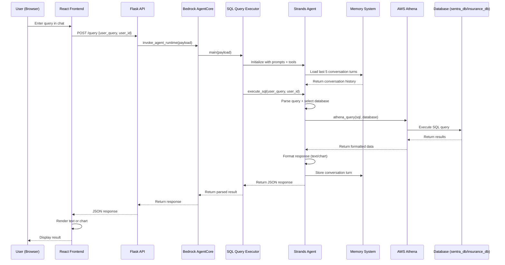
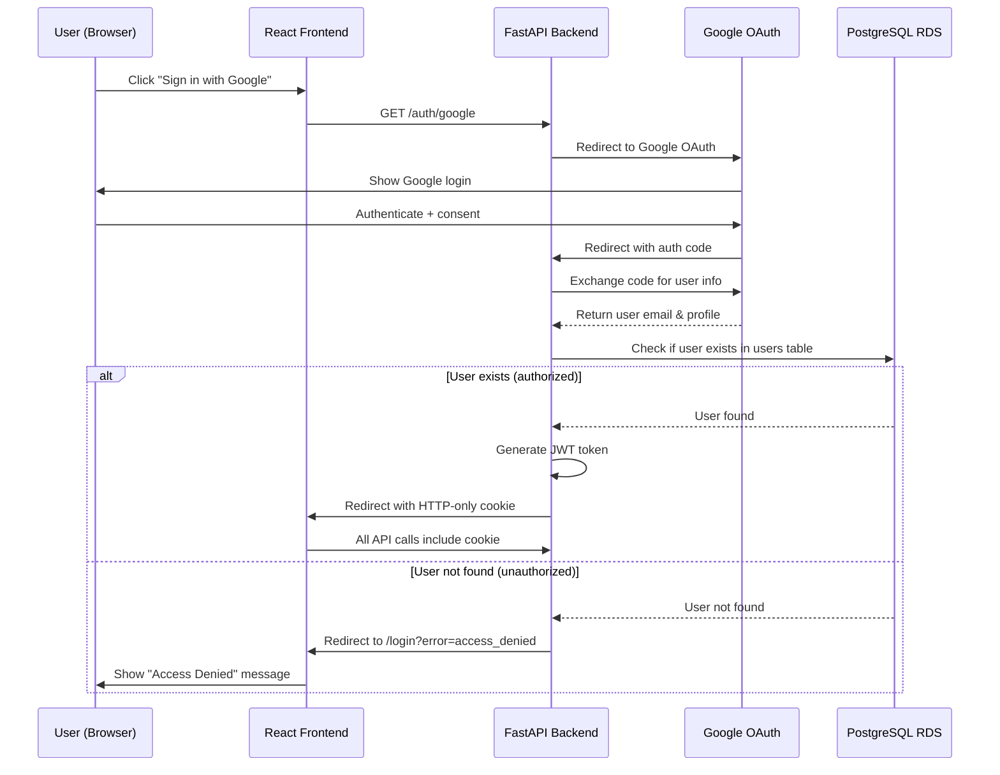

# Sentra Banking & Insurance AI Chatbot - Project Guide

## Project Overview

**Sentra** is an AI-powered banking and insurance chatbot system that enables users to query banking and insurance data through natural language. The system uses AWS Bedrock Agent Core with Claude Sonnet 4 to generate SQL queries against AWS Athena databases and return results in both text and visual formats (charts).

**Key Features:**
- Google OAuth2 authentication with JWT tokens
- Natural language to SQL query generation
- Dual database support (banking + insurance)
- Role-based access control (RBAC)
- Chart visualizations (bar, line, pie, scatter)
- PostgreSQL RDS-based chat history storage
- Multi-session conversation management
- React frontend with chat interface

## Architecture Overview

```
┌─────────────────────────────────────────────────────────────────┐
│                         USER INTERFACE                          │
│                    (React Frontend - Vite)                      │
│  - Google OAuth Login                                           │
│  - Chat Interface with Session Management                       │
│  - Chart Rendering (Recharts)                                   │
│  - User Profile Display                                         │
└────────────────────┬────────────────────────────────────────────┘
                     │ HTTP POST with JWT Cookie
                     │ {user_query, user_id, session_id}
                     ▼
┌─────────────────────────────────────────────────────────────────┐
│                  AUTHENTICATION MIDDLEWARE                      │
│                   (BackendAPI/auth/middleware.py)               │
│  - Validate HTTP-only JWT cookie                                │
│  - Extract user from token                                      │
│  - Authorize request                                            │
└────────────────────┬────────────────────────────────────────────┘
                     │ Authenticated request
                     ▼
┌─────────────────────────────────────────────────────────────────┐
│                      FASTAPI LAYER                              │
│                   (BackendAPI/Agent_Trigger.py)                 │
│  - Protected endpoints with Depends(get_current_user)           │
│  - /query endpoint → Bedrock AgentCore + RDS storage            │
│  - /api/sessions/* → Session management                         │
│  - /auth/* → OAuth flow                                         │
└────────────────────┬────────────────────────────────────────────┘
                     │ boto3.client('bedrock-agentcore')
                     │ invoke_agent_runtime()
                     ▼
┌─────────────────────────────────────────────────────────────────┐
│                  BEDROCK AGENTCORE RUNTIME                      │
│                    (Backend/main.py)                            │
│  - Entry point: @app.entrypoint                                 │
│  - Initializes SQLQueryExecutor                                 │
│  - Handles exceptions and error responses                       │
└────────────────────┬────────────────────────────────────────────┘
                     │ SQLQueryExecutor.execute_sql()
                     ▼
┌─────────────────────────────────────────────────────────────────┐
│                    SQL QUERY EXECUTOR                           │
│                (Backend/agent/sql_agent.py)                     │
│  - Strands Agent with Claude Sonnet 4                           │
│  - System prompts (base + insurance + banking)                  │
│  - Memory hooks for conversation context                        │
│  - Tools: athena_query                                          │
│  - JSON response parsing                                        │
└────────────────────┬────────────────────────────────────────────┘
                     │ Agent invokes tools
                     ▼
┌─────────────────────────────────────────────────────────────────┐
│                      ATHENA QUERY TOOL                          │
│                (Backend/tools/athena_query.py)                  │
│  - @tool decorator for Strands                                  │
│  - Database routing (sentra_db / insurance_db)                  │
│  - Query execution via boto3                                    │
│  - Result parsing and formatting                                │
└────────────────────┬────────────────────────────────────────────┘
                     │ boto3.client('athena')
                     │ start_query_execution()
                     ▼
┌─────────────────────────────────────────────────────────────────┐
│                       AWS ATHENA                                │
│  ┌──────────────────────────────────────────────────────────┐  │
│  │  sentra_db (Banking Database)                            │  │
│  │  - DM_CUSTOMER_MASTER                                    │  │
│  │  - DM_CASA_ACCOUNTS                                      │  │
│  │  - DM_LOAN_ACCOUNTS                                      │  │
│  │  - DM_CREDIT_CARDS                                       │  │
│  │  - DM_SAVINGS_ACCOUNTS                                   │  │
│  │  - DM_CUSTOMER_METRICS                                   │  │
│  │  - DM_CUSTOMER_ACTIVITY                                  │  │
│  │  - DM_CUSTOMER_IDENTIFICATION                            │  │
│  └──────────────────────────────────────────────────────────┘  │
│  ┌──────────────────────────────────────────────────────────┐  │
│  │  insurance_db (Insurance Database)                       │  │
│  │  - INSURANCE_DATA (142 columns)                          │  │
│  └──────────────────────────────────────────────────────────┘  │
└────────────────────┬────────────────────────────────────────────┘
                     │ Query results + RDS storage
                     ▼
┌─────────────────────────────────────────────────────────────────┐
│                    DUAL MEMORY SYSTEM                           │
│  ┌──────────────────────────────────────────────────────────┐  │
│  │  Bedrock AgentCore Memory (Backend/memory/)              │  │
│  │  - In-memory conversation context                        │  │
│  │  - Loads last 5 turns on agent init                      │  │
│  │  - Event expiry: 7 days                                  │  │
│  └──────────────────────────────────────────────────────────┘  │
│  ┌──────────────────────────────────────────────────────────┐  │
│  │  PostgreSQL RDS (BackendAPI/database.py)                 │  │
│  │  - Persistent chat history storage                       │  │
│  │  - Session and turn management                           │  │
│  │  - Multi-session support per user                        │  │
│  │  - User authentication records                           │  │
│  └──────────────────────────────────────────────────────────┘  │
└─────────────────────────────────────────────────────────────────┘
```

## Request Flow Diagram



## Directory Structure

```
Sentra/
├── Backend/
│   ├── agent/
│   │   ├── prompt.py              # System prompts (base, banking, insurance)
│   │   └── sql_agent.py           # SQLQueryExecutor class
│   ├── tools/
│   │   ├── athena_query.py        # Athena query tool
│   │   └── knowledge_base_retrieve.py
│   ├── memory/
│   │   ├── memory_setup.py        # Memory client initialization
│   │   └── memory_hook.py         # Memory hooks for conversation
│   ├── config/
│   │   └── logger.py              # Logging configuration
│   ├── tests/
│   │   ├── test_schema_integrity.py
│   │   ├── validate_final_prompt.py
│   │   ├── sample_insurance_prompts.md
│   │   └── column_explanations.md
│   ├── main.py                    # AgentCore entrypoint
│   ├── requirements.txt           # Python dependencies
│   └── Dockerfile                 # Container configuration
├── BackendAPI/
│   ├── auth/
│   │   ├── __init__.py            # Auth module initialization
│   │   ├── oauth.py               # Google OAuth2 handler
│   │   ├── jwt_handler.py         # JWT token management
│   │   └── middleware.py          # Authentication middleware
│   ├── Agent_Trigger.py           # FastAPI server with auth
│   ├── database.py                # PostgreSQL connection management
│   ├── models_v3.py               # SQLAlchemy models (User, ChatSession, ConversationTurn)
│   ├── auth_schema.sql            # User authentication schema
│   ├── database_schema_v3.sql     # Chat session schema
│   ├── add_authorized_user.py     # User management script
│   ├── requirements.txt           # Python dependencies
│   └── .env                       # Environment configuration
├── Frontend/
│   ├── src/
│   │   ├── components/
│   │   │   ├── ChatInterface.jsx  # Main chat UI with RDS integration
│   │   │   ├── ChatMessage.jsx    # Message rendering
│   │   │   ├── ChartView.jsx      # Chart visualization
│   │   │   ├── Login.jsx          # Google OAuth login screen
│   │   │   ├── Sidebar.jsx        # Session navigation sidebar
│   │   │   ├── UserProfile.jsx    # Dynamic user profile
│   │   │   └── ProtectedRoute.jsx # Route authentication guard
│   │   ├── contexts/
│   │   │   └── AuthContext.jsx    # Authentication state management
│   │   ├── services/
│   │   │   ├── authApi.js         # Authentication API calls
│   │   │   └── chatApi.js         # Chat session API calls
│   │   ├── App.jsx                # Main app component
│   │   └── main.jsx               # React entry point
│   ├── package.json               # Node dependencies
│   └── vite.config.js             # Vite configuration
├── .kiro/
│   ├── specs/
│   │   ├── insurance-schema-update/
│   │   │   ├── requirements.md    # Feature requirements
│   │   │   ├── design.md          # Design document
│   │   │   └── tasks.md           # Implementation tasks
│   │   └── google-oauth2-auth/
│   │       ├── requirements.md    # OAuth requirements
│   │       └── design.md          # OAuth design
│   ├── steering/
│   │   └── sentra-project-guide.md  # This file
│   └── sample_data/
│       └── insurance_synthetic_data.csv
└── README.md
```

## Database Schemas

### Banking Database (sentra_db)

**8 Tables with comprehensive customer data:**

1. **DM_CUSTOMER_MASTER** - Core customer information
   - CIF_NO (primary key), customer demographics, contact info
   - 25 columns including name, DOB, gender, occupation, addresses

2. **DM_CASA_ACCOUNTS** - Current and savings accounts
   - Account balances, transaction history, interest rates
   - 23 columns

3. **DM_SAVINGS_ACCOUNTS** - Fixed deposits and savings
   - Principal amounts, maturity dates, interest accrued
   - 23 columns

4. **DM_LOAN_ACCOUNTS** - Loan information
   - Outstanding balances, payment schedules, overdue status
   - 34 columns

5. **DM_CREDIT_CARDS** - Credit card details
   - Credit limits, balances, transaction counts
   - 26 columns

6. **DM_CUSTOMER_METRICS** - Aggregated customer metrics
   - Product counts, balances, profitability scores
   - 58 columns

7. **DM_CUSTOMER_ACTIVITY** - Digital activity tracking
   - E-banking, mobile app usage, feedback
   - 29 columns

8. **DM_CUSTOMER_IDENTIFICATION** - ID documents
   - Passport, Aadhaar, PAN details
   - 14 columns

**Join Key:** All tables join on `CIF_NO`

### Insurance Database (insurance_db)

**1 Consolidated Table:**

**INSURANCE_DATA** - Complete policy information (142 columns)

**Column Groups:**
- Policy Information (28 columns): policy_number, policy_type, gwp, sum_insured, etc.
- Customer Information (13 columns): customer_id, customer_name, customer_dob, etc.
- Agent Information (15 columns): agent_id, agent_name, agent_category, etc.
- Transaction Information (18 columns): transaction_no, payment_ref, receipt_no, etc.
- Branch Information (8 columns): branch_code, zone, partner_branch_name, etc.
- Benefit Groups (20 columns): benefitgroup_1-10, add_on_prmm_amnt_1-10
- Tax Information (4 columns): igst_amount, cgst_amount, sgst_amount, ugst_amount
- Status and Processing (10 columns): process_status, underwriting_decision, etc.
- Previous Insurance (4 columns): previous_insurer, previous_policy_number, etc.
- Miscellaneous (20 columns): run_year, run_month, ckyc_number, etc.

**Note:** No CIF_NO field - cannot join with banking tables (separate database)

## Authentication System

### Google OAuth2 Flow

**Sentra uses Google OAuth2 for user authentication with JWT token-based session management.**

**Authentication Flow:**



### Authentication Components

#### 1. OAuth Handler (`BackendAPI/auth/oauth.py`)
- Manages Google OAuth2 flow
- Generates authorization URLs with state parameter
- Exchanges authorization codes for user information
- Scopes: `openid`, `email`, `profile`

#### 2. JWT Handler (`BackendAPI/auth/jwt_handler.py`)
- Creates JWT tokens with user ID and email
- Tokens expire after 7 days (configurable)
- Uses HS256 algorithm
- Verifies and decodes tokens

#### 3. Authentication Middleware (`BackendAPI/auth/middleware.py`)
- `get_current_user()` dependency for FastAPI endpoints
- Extracts JWT from HTTP-only cookie (`sentra_jwt_token`)
- Validates token and retrieves user from database
- Returns 401 Unauthorized if invalid/missing token

#### 4. Frontend Auth Context (`Frontend/src/contexts/AuthContext.jsx`)
- Manages authentication state (user, loading, isAuthenticated)
- Provides `login()`, `logout()`, `checkAuth()` functions
- Automatically checks auth on app load
- Handles HTTP-only cookies (sent automatically by browser)

### Access Control Model

**⚠️ CRITICAL: Only pre-registered users can access the application**

**User Registration Process:**
1. Admin manually adds authorized users to PostgreSQL RDS
2. Use script: `python BackendAPI/add_authorized_user.py add <email>`
3. User email is stored in `users` table

**Login Process:**
1. User authenticates via Google OAuth
2. Backend checks if email exists in `users` table
3. **If user exists:** Generate JWT token, set cookie, allow access
4. **If user doesn't exist:** Redirect to login with `access_denied` error

**Authorization Enforcement:**
- All API endpoints protected with `Depends(get_current_user)`
- Frontend routes protected with `<ProtectedRoute>` component
- Unauthorized requests return 401 status
- No automatic user creation - explicit registration required

### User Management

**Add Authorized User:**
```bash
python BackendAPI/add_authorized_user.py add user@example.com
```

**List Authorized Users:**
```bash
python BackendAPI/add_authorized_user.py list
```

**Remove User:**
```bash
python BackendAPI/add_authorized_user.py remove user@example.com
```

### Authentication Endpoints

| Endpoint | Method | Description | Authentication |
|----------|--------|-------------|----------------|
| `/auth/google` | GET | Initiate Google OAuth flow | Public |
| `/auth/google/callback` | GET | Handle OAuth callback, set JWT cookie | Public |
| `/auth/logout` | POST | Logout user, clear cookie | Required |
| `/auth/me` | GET | Get current user info | Required |
| `/auth/verify` | GET | Verify JWT token validity | Required |

## Chat History System (PostgreSQL RDS)

### Overview

Chat history is stored in **PostgreSQL RDS** (not localStorage) for persistence, multi-device access, and data integrity.

**RDS Configuration:**
- **Host:** `database-2-instance-1.crwu46wug6kx.ap-south-1.rds.amazonaws.com`
- **Port:** 5432
- **Database:** `company_db`
- **User:** `postgres`
- **SSL Mode:** require

### Database Schema (V3)

#### Table 1: `users`
```sql
CREATE TABLE users (
    id SERIAL PRIMARY KEY,
    email VARCHAR(255) UNIQUE NOT NULL,
    created_at TIMESTAMP WITH TIME ZONE DEFAULT CURRENT_TIMESTAMP,
    last_login TIMESTAMP WITH TIME ZONE DEFAULT CURRENT_TIMESTAMP
);
```

**Purpose:** Store authorized users for OAuth access control

#### Table 2: `chat_sessions`
```sql
CREATE TABLE chat_sessions (
    session_id UUID PRIMARY KEY DEFAULT gen_random_uuid(),
    user_id VARCHAR(100) NOT NULL,
    session_title VARCHAR(500),
    status VARCHAR(20) DEFAULT 'ACTIVE' CHECK (status IN ('ACTIVE', 'ARCHIVED', 'DELETED')),
    created_at TIMESTAMP WITH TIME ZONE DEFAULT CURRENT_TIMESTAMP,
    updated_at TIMESTAMP WITH TIME ZONE DEFAULT CURRENT_TIMESTAMP,
    last_activity_at TIMESTAMP WITH TIME ZONE DEFAULT CURRENT_TIMESTAMP
);

CREATE INDEX idx_user_sessions ON chat_sessions(user_id, last_activity_at);
CREATE INDEX idx_session_status ON chat_sessions(status, updated_at);
```

**Purpose:** Track individual chat sessions per user

**Key Features:**
- UUID primary key for unique identification
- Soft delete via status field (ACTIVE/ARCHIVED/DELETED)
- Last activity tracking for session ordering
- Multi-session support per user

#### Table 3: `conversation_turns`
```sql
CREATE TABLE conversation_turns (
    turn_id UUID PRIMARY KEY DEFAULT gen_random_uuid(),
    session_id UUID NOT NULL REFERENCES chat_sessions(session_id) ON DELETE CASCADE,
    turn_number INTEGER NOT NULL,
    user_query TEXT NOT NULL,
    assistant_response JSONB,
    model_name VARCHAR(100) DEFAULT 'moonshotai.kimi-k2.5',
    status VARCHAR(20) DEFAULT 'COMPLETED' CHECK (status IN ('PENDING', 'RUNNING', 'COMPLETED', 'FAILED')),
    created_at TIMESTAMP WITH TIME ZONE DEFAULT CURRENT_TIMESTAMP,
    completed_at TIMESTAMP WITH TIME ZONE,
    error_message TEXT,
    UNIQUE(session_id, turn_number)
);

CREATE INDEX idx_session_turns ON conversation_turns(session_id, turn_number);
CREATE INDEX idx_turn_status ON conversation_turns(status, created_at);
CREATE INDEX idx_assistant_response ON conversation_turns USING gin(assistant_response);
```

**Purpose:** Store individual conversation turns (user query + agent response)

**Key Features:**
- Auto-incrementing turn numbers per session
- JSONB storage for assistant response (type, data, explanation, chart info)
- Turn status tracking (PENDING → RUNNING → COMPLETED/FAILED)
- Cascading delete when session deleted
- GIN index on JSONB for efficient querying

### Session Management API

#### Create Session
```http
POST /api/sessions
Authorization: Cookie (sentra_jwt_token)
Body: {
  "user_id": "user@example.com",
  "session_title": "New Chat"
}
Response: {
  "id": "uuid",
  "user_id": "user@example.com",
  "title": "New Chat",
  "status": "ACTIVE",
  "createdAt": 1234567890,
  "updatedAt": 1234567890,
  "lastActivityAt": 1234567890
}
```

#### Get User Sessions
```http
GET /api/sessions/{user_id}
Authorization: Cookie (sentra_jwt_token)
Response: [
  {
    "id": "uuid",
    "user_id": "user@example.com",
    "title": "Insurance Analysis",
    "status": "ACTIVE",
    "createdAt": 1234567890,
    "updatedAt": 1234567890,
    "lastActivityAt": 1234567890
  }
]
```

#### Get Session Turns (Messages)
```http
GET /api/sessions/{session_id}/turns
Authorization: Cookie (sentra_jwt_token)
Response: [
  {
    "id": "turn_id_user",
    "type": "user",
    "content": "How many policies do we have?",
    "timestamp": 1234567890
  },
  {
    "id": "turn_id_bot",
    "type": "bot",
    "content": {
      "type": "text",
      "data": "150",
      "explanation": "There are 150 active policies"
    },
    "timestamp": 1234567891
  }
]
```

#### Update Session
```http
PUT /api/sessions/{session_id}
Authorization: Cookie (sentra_jwt_token)
Body: {
  "session_title": "Policy Analysis Q1",
  "status": "ARCHIVED"
}
```

#### Delete Session
```http
DELETE /api/sessions/{session_id}
Authorization: Cookie (sentra_jwt_token)
Response: {
  "message": "Session deleted successfully",
  "session_id": "uuid"
}
```

### Query Endpoint Integration

The `/query` endpoint automatically manages sessions and turns:

```http
POST /query
Authorization: Cookie (sentra_jwt_token)
Body: {
  "user_query": "Show me policy count by type",
  "user_id": "user@example.com",
  "session_id": "uuid-optional"  // Creates new if not provided
}
Response: {
  "type": "bar",
  "data": [...],
  "explanation": "...",
  "session_id": "uuid",
  "turn_number": 1
}
```

**Automatic Behavior:**
1. If `session_id` provided → Use existing session
2. If no `session_id` → Create new session automatically
3. Create `ConversationTurn` with status RUNNING
4. Call Bedrock AgentCore
5. Update turn with response and status COMPLETED
6. Return response with session_id and turn_number

### Frontend Integration

**Session Loading:**
```javascript
// Load all user sessions on ChatInterface mount
const loadSessions = async () => {
  const sessions = await chatApi.getSessions(user.email);
  setSessions(sessions);
};
```

**Message Loading:**
```javascript
// Load messages when session selected
const loadMessages = async (sessionId) => {
  const turns = await chatApi.getSessionMessages(sessionId);
  setMessages(turns);  // Array of user/bot messages
};
```

**Sending Messages:**
```javascript
// Send message with current session_id
const response = await fetch('/query', {
  method: 'POST',
  credentials: 'include',  // Include cookies
  body: JSON.stringify({
    user_query: message,
    user_id: user.email,
    session_id: currentSessionId
  })
});
```

### Dual Memory Architecture

Sentra uses **two separate memory systems**:

#### 1. Bedrock AgentCore Memory (Short-term)
- **Purpose:** Provide conversation context to AI agent
- **Storage:** AWS Bedrock Memory service
- **Duration:** 7 days
- **Scope:** Last 5 turns loaded on agent initialization
- **Use Case:** Agent needs recent context for follow-up questions

#### 2. PostgreSQL RDS (Long-term)
- **Purpose:** Persistent chat history storage
- **Storage:** RDS PostgreSQL database
- **Duration:** Indefinite (until manually deleted)
- **Scope:** All sessions and turns
- **Use Case:** User can view all past conversations, switch sessions

**Why Both?**
- Bedrock memory optimized for agent context (fast, temporary)
- RDS optimized for user experience (persistent, queryable, multi-session)

## Access Control (RBAC)

**⚠️ IMPORTANT: RBAC is ONLY enforced on sentra_db (Banking Database)**
**Insurance database (insurance_db) has NO access restrictions - all users can query all data**

**User Roles and Permissions (Banking Data Only):**

| User ID | Access Level | CIF_NO Range | Description |
|---------|--------------|--------------|-------------|
| `kamaljeet.singh` | Admin | ALL | Full access to all banking customers |
| `vishal.saxena` | Manager | CIF200000-CIF200025 | Access to 26 banking customers |
| `harsh.kumar` | Agent | CIF200026-CIF200099 | Access to 74 banking customers |

**Implementation:**
- **Banking (sentra_db):** RBAC enforced via `base_prompt` persona access rules
  - SQL WHERE clauses automatically filtered by CIF_NO
  - Access violations return error message
  - User can only see their assigned CIF_NO range
- **Insurance (insurance_db):** NO access restrictions
  - All users can query all insurance policies
  - No CIF_NO filtering applied
  - No access violation checks

## Response Format

The agent returns JSON responses in 4 formats:

### 1. General Questions (No Data Query)
```json
{
    "type": "text",
    "data": "",
    "explanation": "your response",
    "customer_specific": "False",
    "query_executed": ""
}
```

### 2. Chart/Plot Data (PREFERRED for GROUP BY)
```json
{
    "type": "bar" | "line" | "pie" | "scatter",
    "data": [
        {"label": "Label1", "value": "25"},
        {"label": "Label2", "value": "30"}
    ],
    "explanation": "explain the trend in the data",
    "customer_specific": "False",
    "query_executed": "SELECT ..."
}
```

**Chart Type Selection:**
- **bar**: Categorical comparisons (policy types, agents, zones)
- **pie**: Percentage distributions (market share, breakdown)
- **line**: Time-series trends (monthly, yearly patterns)
- **scatter**: Correlations (premium vs coverage)

### 3. Aggregate Values (Single Value)
```json
{
    "type": "text",
    "data": "123",
    "explanation": "explain the answer",
    "customer_specific": "False",
    "query_executed": "SELECT COUNT(*) ..."
}
```

### 4. Customer-Specific Information
```json
{
    "type": "text",
    "data": {
        "name": "customer_name",
        "age": "23",
        "state": "state_name",
        "cif_no": "CIF200050"
    },
    "explanation": "brief about the customer",
    "customer_specific": "True",
    "query_executed": "SELECT * FROM dm_customer_master WHERE ..."
}
```

## Key System Prompts

### Database Selection Rules

**STEP 1: Identify query type**
- Contains: insurance, policy, premium, coverage → INSURANCE QUERY
- Contains: customer, account, loan, card, CIF, banking → BANKING QUERY

**STEP 2: Select correct database**
- INSURANCE QUERY → `database="insurance_db"`
- BANKING QUERY → `database="sentra_db"`

**STEP 3: Query correct tables**
- insurance_db has: INSURANCE_DATA
- sentra_db has: DM_CUSTOMER_MASTER, DM_CASA_ACCOUNTS, etc.

### Visualization Preference Rule

🎯 **ALWAYS prefer chart format (bar/line/pie/scatter) over text when query has GROUP BY**
- Use charts for comparisons, distributions, trends, and aggregations
- Only use text format for single values or when charts don't make sense

### LIMIT Clause Rules

🚫 **DO NOT add LIMIT unless explicitly requested by user**

**When to use LIMIT:**
- User asks for "first 10", "top 5", "sample 20"
- User explicitly specifies a number

**When NOT to use LIMIT (return ALL data):**
- User asks for "all policies", "show policies", "list customers"
- User asks "get all data", "show me everything"
- User doesn't specify a limit
- Aggregation queries (COUNT, SUM, AVG, GROUP BY)

**Examples:**
- ✅ "Show me all insurance policies" → `SELECT * FROM insurance_data` (no LIMIT)
- ✅ "List all customers" → `SELECT * FROM dm_customer_master` (no LIMIT)
- ✅ "Get policy count by type" → `SELECT policy_type, COUNT(*) FROM insurance_data GROUP BY policy_type` (no LIMIT)
- ✅ "Show first 10 policies" → `SELECT * FROM insurance_data LIMIT 10` (LIMIT used)
- ✅ "Top 5 agents by premium" → `SELECT agent_name, SUM(gwp) FROM insurance_data GROUP BY agent_name ORDER BY SUM(gwp) DESC LIMIT 5` (LIMIT used)

## Technology Stack

### Backend
- **Python 3.x**
- **FastAPI** - Modern REST API framework (replaced Flask)
- **SQLAlchemy** - ORM for PostgreSQL
- **PostgreSQL** - RDS database for chat history
- **boto3** - AWS SDK
- **Strands** - Agent framework
- **bedrock-agentcore** - AWS Bedrock Agent Core
- **AWS Bedrock** - Claude Sonnet 4 (apac.anthropic.claude-sonnet-4-20250514-v1:0)
- **AWS Athena** - SQL query engine
- **AWS S3** - Query result storage
- **Google OAuth2** - Authentication
- **PyJWT** - JWT token management

### Frontend
- **React 18**
- **Vite** - Build tool
- **Recharts** - Chart library
- **Lucide React** - Icons
- **React Router** - Navigation
- **CSS3** - Styling

### AWS Services
- **Bedrock Agent Core Runtime** - Agent execution
- **Bedrock Memory** - Conversation storage
- **Athena** - SQL queries
- **S3** - Data storage
- **IAM** - Access control
- **RDS PostgreSQL** - Chat history database

## Environment Configuration

### Backend Environment Variables (`BackendAPI/.env`)
```bash
# AWS Configuration
AWS_REGION=ap-south-1
AWS_ACCESS_KEY_ID=<your-key>
AWS_SECRET_ACCESS_KEY=<your-secret>

# PostgreSQL RDS Configuration
DB_HOST=database-2-instance-1.crwu46wug6kx.ap-south-1.rds.amazonaws.com
DB_PORT=5432
DB_NAME=company_db
DB_USER=postgres
DB_PASSWORD=lumiq121
DB_SSLMODE=require

# Google OAuth2 Configuration
GOOGLE_CLIENT_ID=GOOGLE_CLIENT_ID
GOOGLE_CLIENT_SECRET=GOOGLE_CLIENT_SECRET
GOOGLE_REDIRECT_URI=http://localhost:5000/auth/google/callback

# JWT Configuration
JWT_SECRET_KEY=<your-secret-key>
JWT_ALGORITHM=HS256
JWT_EXPIRATION_DAYS=7

# Cookie Configuration
COOKIE_SECURE=False  # Set True for HTTPS in production
COOKIE_SAMESITE=lax
COOKIE_DOMAIN=localhost

# Frontend URL
FRONTEND_URL=http://localhost:5173
```

### Frontend Environment Variables (`Frontend/.env`)
```bash
VITE_API_URL=http://localhost:5000
```

### AWS Resources
```
AgentCore Runtime ARN: arn:aws:bedrock-agentcore:ap-south-1:628897991744:runtime/Sentra_Agent-vtVCPEFWbx
S3 Output Location: s3://bedrock-agentcore-runtime-628897991744-ap-south-1-3m5mgapsu7/QueryOutput/
Memory Name: Sentra_Agent_Memory
RDS Instance: database-2-instance-1.crwu46wug6kx.ap-south-1.rds.amazonaws.com
Database Name: company_db
Region: ap-south-1
```

### Google OAuth2 Configuration
```
Client ID: Client ID:
Authorized Redirect URI: http://localhost:5000/auth/google/callback
Authorized JavaScript Origins: http://localhost:5000, http://localhost:5173
```

## Development Workflow

### Initial Setup

**1. PostgreSQL RDS Setup:**
```bash
cd BackendAPI
# Create database schema
psql -h database-2-instance-1.crwu46wug6kx.ap-south-1.rds.amazonaws.com \
     -U postgres -d company_db -f auth_schema.sql
psql -h database-2-instance-1.crwu46wug6kx.ap-south-1.rds.amazonaws.com \
     -U postgres -d company_db -f database_schema_v3.sql

# Add authorized users
python add_authorized_user.py add admin@example.com
python add_authorized_user.py list
```

**2. Environment Configuration:**
```bash
# Configure BackendAPI/.env with database and OAuth credentials
cp BackendAPI/.env.example BackendAPI/.env
# Edit .env with your credentials

# Configure Frontend/.env
cp Frontend/.env.example Frontend/.env
# Set VITE_API_URL=http://localhost:5000
```

### Running Backend
```bash
cd BackendAPI
pip install -r requirements.txt
python Agent_Trigger.py  # Starts FastAPI on port 5000
# Or use: uvicorn Agent_Trigger:app --reload --port 5000
```

### Running Frontend
```bash
cd Frontend
npm install
npm run dev  # Starts Vite dev server on port 5173
```

### User Management
```bash
cd BackendAPI

# Add authorized user
python add_authorized_user.py add user@example.com

# List all users
python add_authorized_user.py list

# Remove user
python add_authorized_user.py remove user@example.com
```

### Testing
```bash
# Backend tests
cd Backend
python tests/test_schema_integrity.py
python tests/validate_final_prompt.py

# Frontend (manual testing via browser)
```

## Common Development Tasks

### Adding a New Database Table

1. **Update prompt.py**
   - Add table schema to `customer_schema_prompt` or `insurance_schema_prompt`
   - Include all columns with data types
   - Add example queries

2. **Update design.md**
   - Document the new table structure
   - Add to data models section

3. **Test queries**
   - Verify agent can query the new table
   - Check access control if applicable

### Modifying Response Format

1. **Update base_prompt**
   - Modify RESPONSE FORMAT section
   - Add examples

2. **Update Frontend**
   - Modify ChatMessage.jsx to handle new format
   - Update ChartView.jsx if adding new chart types

3. **Test end-to-end**
   - Send test queries
   - Verify rendering

### Adding New User Role

1. **Update base_prompt**
   - Add user to PERSONA ACCESS RULES
   - Define CIF_NO range

2. **Update Frontend**
   - Add user to Login.jsx dropdown

3. **Test access control**
   - Verify user can only access their CIF range
   - Test access violation handling

## Troubleshooting

### Authentication Issues

#### OAuth Callback Error: "Invalid state parameter"
**Symptom:** User redirected to callback with invalid state error
**Solution:**
- For development: State validation relaxed (states stored in memory)
- For production: Use Redis or database to persist OAuth states
- Verify GOOGLE_REDIRECT_URI matches Google Console configuration
- Check FRONTEND_URL environment variable is correct

#### "Access Denied" on Login
**Symptom:** User successfully authenticates with Google but sees "Access Denied"
**Solution:**
- User email not in `users` table (only pre-registered users allowed)
- Add user: `python add_authorized_user.py add user@example.com`
- Verify user exists: `python add_authorized_user.py list`
- Check OAuth callback logs for email mismatch

#### "Not authenticated" Error on API Calls
**Symptom:** API returns 401 Unauthorized
**Solution:**
- JWT cookie not set or expired (7-day expiration)
- Verify cookie exists in browser DevTools → Application → Cookies
- Check `COOKIE_DOMAIN` matches your domain (use `localhost` for dev)
- Ensure `credentials: 'include'` in frontend fetch calls
- Verify `allow_credentials=True` in CORS configuration

#### Cookie Not Being Set
**Symptom:** Login successful but user not authenticated
**Solution:**
- Check cookie configuration in FastAPI response
- Verify `httponly=True`, `samesite='lax'`, `secure=False` (dev)
- For production: Set `secure=True` and use HTTPS
- Check browser console for cookie rejection warnings
- Verify frontend and backend on same domain (or proper CORS setup)

### Database Connection Issues

#### RDS Connection Timeout
**Symptom:** "Connection timed out" when connecting to RDS
**Solution:**
- Check RDS security group allows inbound traffic on port 5432
- Verify your IP address is whitelisted in security group
- Confirm VPC and network configuration
- Test with: `python BackendAPI/database.py`

#### "Database connection failed" Error
**Symptom:** FastAPI starts but database connection fails
**Solution:**
- Verify DB_HOST, DB_PORT, DB_NAME in .env
- Check DB_USER and DB_PASSWORD are correct
- Ensure DB_SSLMODE=require for RDS
- Test connection: `psql -h $DB_HOST -U $DB_USER -d $DB_NAME`

#### "Table does not exist" Error
**Symptom:** SQL error about missing tables
**Solution:**
- Run schema creation scripts:
  ```bash
  psql -h $DB_HOST -U $DB_USER -d $DB_NAME -f auth_schema.sql
  psql -h $DB_HOST -U $DB_USER -d $DB_NAME -f database_schema_v3.sql
  ```
- Verify tables created: `\dt` in psql

### Session Management Issues

#### Sessions Not Loading
**Symptom:** Sidebar shows no sessions or empty
**Solution:**
- Check user is authenticated (JWT cookie valid)
- Verify user_id in database matches email from OAuth
- Check browser console for API errors
- Verify `/api/sessions/{user_id}` endpoint returns data

#### Messages Not Saving
**Symptom:** Chat works but history not persisted
**Solution:**
- Check `/query` endpoint creates turn records
- Verify session_id passed in request
- Check database for ConversationTurn entries
- Review API logs for database errors

#### Turn Number Conflicts
**Symptom:** "UNIQUE constraint violation" on turn_number
**Solution:**
- Database trigger auto-increments turn_number (should not happen)
- Check if manual turn creation bypasses trigger
- Verify session_id is correct UUID format

### Agent & Query Issues

#### Agent Returns Wrong Database
**Symptom:** Insurance queries go to sentra_db or vice versa
**Solution:** 
- Check query keywords match database selection rules
- Verify `database` parameter in athena_query tool call
- Review agent logs for database selection

#### Charts Not Rendering
**Symptom:** Data returned but chart doesn't display
**Solution:**
- Verify response type is "bar", "line", "pie", or "scatter"
- Check data array has label-value pairs
- Inspect browser console for errors
- Verify Recharts is installed

#### Access Violation Not Working (Banking Queries Only)
**Symptom:** Users can see banking data outside their CIF range
**Solution:**
- Check user_id is passed correctly from frontend
- Verify PERSONA ACCESS RULES in base_prompt
- Ensure WHERE clause includes CIF_NO filter for sentra_db queries
- Review SQL query in response
**Note:** Insurance queries (insurance_db) have NO access restrictions by design

#### Memory Not Persisting
**Symptom:** Agent doesn't remember previous conversation
**Solution:**
- Check memory_id is set correctly in Bedrock AgentCore
- Verify actor_id and session_id in agent state
- Check memory expiry (7 days default)
- Note: Long-term history in RDS, short-term context in Bedrock Memory

#### Athena Query Timeout
**Symptom:** Query takes too long or times out
**Solution:**
- Optimize SQL query (add WHERE clauses, LIMIT)
- Check Athena workgroup configuration
- Verify S3 output location is accessible
- Increase timeout in botocore config

## Best Practices

### Prompt Engineering
- Put critical instructions at the beginning
- Use visual separators (═══) for clarity
- Include examples for complex behaviors
- Be explicit about database selection
- Emphasize chart preference for GROUP BY

### SQL Query Generation
- Always specify database parameter (sentra_db or insurance_db)
- **DO NOT add LIMIT unless user explicitly requests "first N" or "top N"**
- **Return ALL data by default when user asks for "all", "show", "list", "get"**
- **Apply CIF_NO filters ONLY for banking queries (sentra_db)**
- **Do NOT apply CIF_NO filters for insurance queries (insurance_db)**
- Use appropriate aggregation functions
- Handle NULL values gracefully

### Error Handling
- Return user-friendly error messages
- Log detailed errors for debugging
- Handle Athena query failures
- Validate JSON responses
- Catch and report exceptions

### Performance
- **Only use LIMIT when user explicitly requests limited results**
- **Return complete datasets by default - users expect all data**
- Use appropriate indexes (Athena partitions)
- Cache frequently accessed data
- Optimize GROUP BY queries
- Monitor query execution times

### Security
- Never expose AWS credentials or database passwords
- **Enforce RBAC at prompt level for sentra_db ONLY**
- **No RBAC enforcement for insurance_db**
- **Only pre-registered users can login (no auto-registration)**
- Store JWT tokens in HTTP-only cookies (not localStorage)
- Use secure cookies (HTTPS) in production
- Validate user authentication on all protected endpoints
- Sanitize SQL queries (Athena handles this)
- Use IAM roles for AWS access
- Rotate JWT_SECRET_KEY regularly
- Implement rate limiting on auth endpoints (production)

## Sample Queries

### Banking Queries
```
"How many customers do we have?"
"Show me the top 10 customers by total assets"
"What is the average loan balance?"
"Show me customers with overdue loans"
"Compare savings vs CASA account balances"
```

### Insurance Queries
```
"How many insurance policies do we have?"
"Show me policy count by type"
"What is the total GWP by agent?"
"Which zones have the most policies?"
"Show me monthly policy trends for 2025"
```

### Chart Queries
```
"Show me policy distribution by type" → Pie chart
"Compare premium by agent" → Bar chart
"Show monthly policy trends" → Line chart
"Premium vs sum insured relationship" → Scatter chart
```

## Recent Updates

### Google OAuth2 Authentication (June 2026)
- Implemented Google OAuth2 with JWT token-based authentication
- HTTP-only cookie storage for security
- Pre-registered user access control (no auto-registration)
- User management script for authorization
- Protected all API endpoints with authentication middleware
- Frontend AuthContext and ProtectedRoute components

### PostgreSQL RDS Chat History (June 2026)
- Migrated from localStorage to PostgreSQL RDS
- UUID-based session management
- Conversation turns with auto-sequencing
- Dual memory system (Bedrock + RDS)
- Multi-session support per user
- Session CRUD operations via REST API
- Frontend integration with session sidebar

### Insurance Schema Update (Dec 2025)
- Migrated from 2-table structure (INSURANCE_POLICIES, INSURANCE_CLAIMS) to single INSURANCE_DATA table
- Added all 142 columns with data types
- Updated all prompts and examples
- Validated schema integrity

### Visualization Preference (Dec 2025)
- Added chart preference for GROUP BY queries
- Defined chart type selection rules
- Updated response format documentation
- Enhanced user experience with visual data

## Support and Documentation

### Internal Documentation
- `.kiro/specs/google-oauth2-auth/` - OAuth authentication specs
- `.kiro/specs/insurance-schema-update/` - Schema update specs
- `Backend/tests/sample_insurance_prompts.md` - Query examples
- `Backend/tests/column_explanations.md` - Column definitions
- `Backend/tests/visualization_preference_update.md` - Chart guidelines
- `BackendAPI/API_ENDPOINTS.md` - API endpoint documentation
- `BackendAPI/V3_IMPLEMENTATION_GUIDE.md` - V3 migration guide
- `BackendAPI/GOOGLE_OAUTH_REQUIRED_CONFIGS.md` - OAuth setup guide

### Configuration Files
- `BackendAPI/.env` - Backend environment variables
- `BackendAPI/auth_schema.sql` - User authentication schema
- `BackendAPI/database_schema_v3.sql` - Chat session schema
- `Frontend/.env` - Frontend environment variables

### Management Scripts
- `BackendAPI/add_authorized_user.py` - User management
- `BackendAPI/setup_database.py` - Database initialization
- `BackendAPI/test_rds_connection.py` - Connection testing

### External Resources
- AWS Bedrock Documentation
- Strands Framework Docs
- React + Vite Documentation
- Recharts Documentation

## Contact and Ownership

**Project:** Sentra Banking & Insurance AI Chatbot
**AWS Account:** 628897991744
**Region:** ap-south-1 (Mumbai)
**Database:** PostgreSQL RDS (company_db)
**Authentication:** Google OAuth2 with JWT
**Last Updated:** June 2026

---

**Note:** This steering document is automatically included in all Kiro AI agent contexts to provide comprehensive project understanding.
